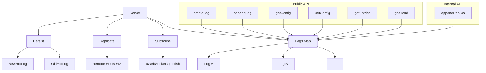
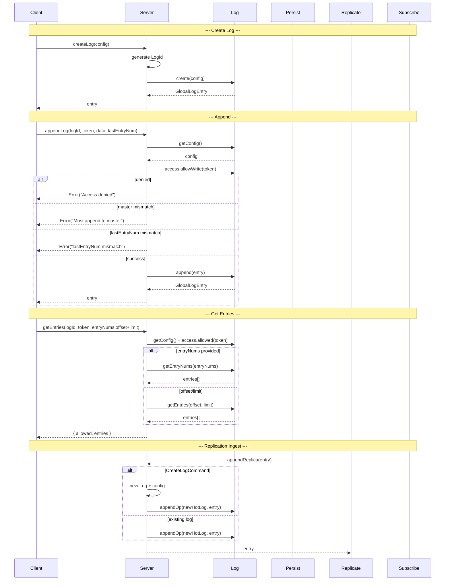

# Server Spec

**Module: Server**

## Overview

Top-level server orchestrator. Initializes `Persist`, `Replicate`, and `Subscribe` subsystems. Owns a `Map<logId, Log>` registry. Exposes the public API for all client operations: `createLog`, `appendLog`, `getConfig`, `setConfig`, `getEntries`, `getHead`, and `deleteLog`. Also exposes `appendReplica` for internal replication ingestion.

## Component Specifications

```typescript
type ServerConfig = {
    host: string
    dataDir: string
    pageSize: number
    globalIndexCountLimit: number
    globalIndexSizeLimit: number
    hotLogFileName?: string
    blobDir?: string
    logDir?: string
    hosts: string[]
    hostMonitorInterval: number
    replicatePath: string
    replicateTimeout: number
    secret: string
}

class Server {
    config: ServerConfig
    persist: Persist
    replicate: Replicate
    subscribe: Subscribe
    uws: TemplatedApp
    logs: Map<string, Log>
}
```

## System Architecture



## Detailed Data Flow



## Visualization

```html
<div id="server-viz"></div>
<script src="https://d3js.org/d3.v7.min.js"></script>
<script>
(function() {
    const ANIMATION_DURATION_MS = 4000;
    const ANIMATION_KEYFRAMES = [
        { label: "Server Init", logs: 0, persist: "ready", replicate: "disconnected", subscribe: "idle" },
        { label: "Create Log", logs: 1, persist: "ready", replicate: "connected", subscribe: "idle" },
        { label: "Append Entry", logs: 1, persist: "writing", replicate: "replicating", subscribe: "publishing" },
        { label: "Get Entries", logs: 1, persist: "reading", replicate: "connected", subscribe: "idle" },
        { label: "Replication Ingest", logs: 2, persist: "writing", replicate: "receiving", subscribe: "idle" },
    ];
    let currentFrame = 0;
    let animationId = null;
    let isPlaying = false;

    const container = d3.select("#server-viz");
    container.html("");

    const svg = container.append("svg").attr("width", 650).attr("height", 250);

    // Subsystems
    const modules = [
        { label: "Persist", x: 40, color: "#2196f3" },
        { label: "Replicate", x: 240, color: "#9c27b0" },
        { label: "Subscribe", x: 440, color: "#4caf50" },
    ];

    modules.forEach(m => {
        const g = svg.append("g").attr("transform", `translate(${m.x}, 60)`);
        g.append("rect").attr("class", "mod-box").attr("width", 160).attr("height", 80)
            .attr("rx", 8).attr("fill", "#f5f5f5").attr("stroke", m.color).attr("stroke-width", 2);
        g.append("text").attr("x", 80).attr("y", 25).attr("text-anchor", "middle")
            .attr("font-size", "13").attr("font-weight", "bold").attr("fill", m.color).text(m.label);
        g.append("text").attr("class", `mod-status-${m.label.toLowerCase()}`).attr("x", 80).attr("y", 55)
            .attr("text-anchor", "middle").attr("font-size", "12").attr("fill", "#666").text("status");
    });

    // Log count
    const logG = svg.append("g").attr("transform", "translate(20, 20)");
    logG.append("text").attr("font-size", "13").attr("fill", "#333").text("Logs: ");
    logG.append("text").attr("class", "log-count").attr("x", 55).attr("y", 13)
        .attr("font-size", "13").attr("font-weight", "bold").text("0");

    // Frame label
    svg.append("text").attr("class", "frame-label").attr("x", 325).attr("y", 220)
        .attr("text-anchor", "middle").attr("font-size", "14").attr("fill", "#333");

    // Controls
    const controls = container.append("div").style("margin-top","10px");
    controls.append("button").attr("data-testid","play-pause").text("▶ Play").on("click", togglePlay);
    controls.append("span").style("margin-left","10px").text("Frame: ");
    controls.append("span").attr("id","kf-total").text("0 / 4");
    controls.append("input").attr("type","range").attr("min",0).attr("max",ANIMATION_KEYFRAMES.length-1).attr("value",0)
        .style("width","300px").style("margin-left","10px").on("input", function() { jumpToKeyframe(+this.value); });

    function update(kf) {
        const statuses = [kf.persist, kf.replicate, kf.subscribe];
        const modKeys = ["persist", "replicate", "subscribe"];
        modKeys.forEach((key, i) => {
            svg.select(`text.mod-status-${key}`).text(statuses[i]);
        });
        svg.select("text.log-count").text(kf.logs);
        svg.select("text.frame-label").text(kf.label);
        d3.select("#kf-total").text(`${kf.label} (${currentFrame} / ${ANIMATION_KEYFRAMES.length-1})`);
    }

    function togglePlay() {
        isPlaying = !isPlaying;
        d3.select("[data-testid=play-pause]").text(isPlaying ? "⏸ Pause" : "▶ Play");
        if (isPlaying) {
            animationId = setInterval(() => {
                currentFrame = (currentFrame + 1) % ANIMATION_KEYFRAMES.length;
                update(ANIMATION_KEYFRAMES[currentFrame]);
                d3.select("input[type=range]").property("value", currentFrame);
            }, ANIMATION_DURATION_MS / ANIMATION_KEYFRAMES.length);
        } else if (animationId) {
            clearInterval(animationId);
            animationId = null;
        }
    }

    function jumpToKeyframe(frame) {
        if (isPlaying) togglePlay();
        currentFrame = frame;
        update(ANIMATION_KEYFRAMES[frame]);
        d3.select("input[type=range]").property("value", frame);
    }

    function resetAnimation() {
        if (isPlaying) togglePlay();
        jumpToKeyframe(0);
    }

    function getAnimationState() {
        return { currentFrame, totalFrames: ANIMATION_KEYFRAMES.length, isPlaying, keyframe: ANIMATION_KEYFRAMES[currentFrame] };
    }

    update(ANIMATION_KEYFRAMES[0]);
    setTimeout(() => console.log("ANIMATION_VERIFICATION: Server viz loaded, 5 keyframes, ready"), 100);
})();
</script>
```

## Testing Requirements

| # | Test Case | Input | Expected |
|---|-----------|-------|----------|
| 1 | Create log — random LogId | `createLog({type:"json"})` | LogId generated, config.master set to host, entry returned |
| 2 | Create log — user sets logId | `createLog({logId:"..."})` | Throws `Error("Setting logId not allowed")` |
| 3 | Create log — master mismatch | `createLog({master:"other"})` | Throws `Error("config.master must be host")` |
| 4 | Append — access denied | Wrong token | Throws `Error("Access denied")` |
| 5 | Append — stopped log | `config.stopped=true` | Throws `Error("Log is stopped")` |
| 6 | Append — master mismatch | Wrong host master | Throws `Error("Must append to master")` |
| 7 | Append — lastEntryNum mismatch | Wrong lastEntryNum | Throws `Error("lastEntryNum mismatch")` |
| 8 | Append — JSON type | `config.type="json"` | Creates `JSONLogEntry` |
| 9 | Append — binary type | `config.type="binary"` | Creates `BinaryLogEntry` |
| 10 | Get entries — entryNums string | `"1,2,3"` | Parsed, `getEntryNums([1,2,3])` |
| 11 | Get entries — max response limit | > `MAX_RESPONSE_ENTRIES` | Throws `Error("Maximum number of entries is N")` |
| 12 | Get entries — no read access | Token without read/admin | Throws `Error("Access denied")` |
| 13 | Get head — success | Valid token | Returns `{ allowed, entry }` |
| 14 | SetConfig — not admin | Non-admin token | Throws `Error("Access denied")` |
| 15 | SetConfig — stop with extra keys | `{stopped:true, otherKey:1}` | Throws `Error("Cannot change config when stopping log")` |
| 16 | SetConfig — stop on non-member host | Not in replication group | Throws error about member host |
| 17 | SetConfig — config change on non-master | Not master | Throws `Error("Must setConfig on master")` |
| 18 | Append replica — new log | CreateLogCommand | Log created and appended |
| 19 | Delete log | Any logId | Returns `false` (always) |

---

## 7. Source-Test Cross-References

### Test Coverage

| Test Spec | Path |
|---|---|
| Server.test.spec.md | `source/src/lib/server/Server.test.spec.md` |
