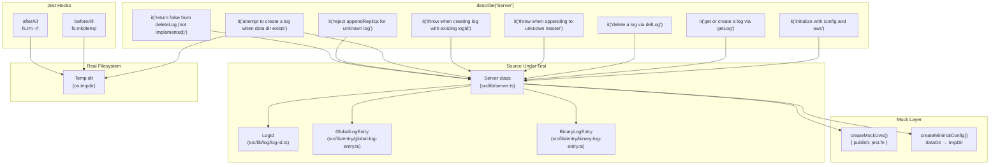
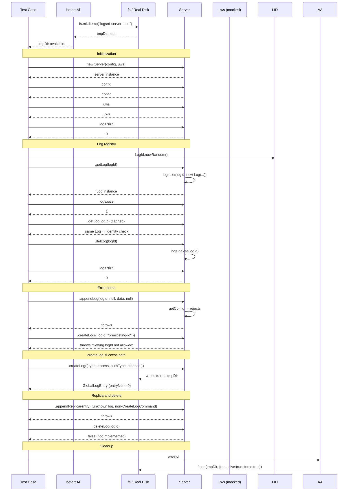

# Server — Test Specification

## Overview

Tests the `Server` class (`src/lib/server.ts`) which manages the central server runtime — configuration binding, log creation/retrieval/deletion, entry appending (both direct and replica), and lifecycle operations. The test suite validates server initialization, log registry mutations, error paths for invalid operations, and the interaction with real filesystem for `createLog`.

## Component Specifications

| Pattern | Details |
|---|---|
| **Framework** | `@jest/globals` (`describe`/`it`/`expect`/`jest`) |
| **Real I/O** | Uses `fs.mkdtemp` / `fs.rm` for a temporary data directory (real, not mocked) |
| **Setup hook** | `beforeAll` — creates a temp directory via `fs.mkdtemp` |
| **Teardown hook** | `afterAll` — removes temp directory recursively via `fs.rm(tmpDir, {recursive: true, force: true})` |
| **Mocks** | `createMockUws()` — returns `{ publish: jest.fn() }` to stand in for the uWebSockets.js app |
| **Config factory** | `createMinimalConfig()` — returns a minimal `ServerConfig` object referencing `tmpDir` as `dataDir` |
| **Source under test** | `src/lib/server.ts` |
| **Dependencies** | `BinaryLogEntry` (`src/lib/entry/binary-log-entry.ts`), `GlobalLogEntry` (`src/lib/entry/global-log-entry.ts`), `LogId` (`src/lib/log/log-id.ts`) |

## System Architecture



## Detailed Data Flow



## Visualization

```d3
<svg id="server-spec-viz" width="800" height="500" viewBox="0 0 800 500" xmlns="http://www.w3.org/2000/svg">
  <style>
    .bar { fill: #27ae60; transition: all 200ms; }
    .bar-error { fill: #e74c3c; }
    .bar-label { font-family: monospace; font-size: 11px; text-anchor: middle; fill: #333; }
    .axis text { font-family: monospace; font-size: 10px; fill: #666; }
    .axis line, .axis path { stroke: #ccc; stroke-width: 1; }
    .kf-marker { fill: #e67e22; }
    .kf-label { font-family: monospace; font-size: 10px; fill: #e67e22; text-anchor: middle; }
    .control-btn { font-family: monospace; font-size: 12px; cursor: pointer; fill: #fff; stroke: #27ae60; stroke-width: 1.5; rx: 4; ry: 4; }
    .control-btn:hover { fill: #e8f0fe; }
    .control-text { font-family: monospace; font-size: 11px; text-anchor: middle; fill: #27ae60; cursor: pointer; user-select: none; }
    #kf-info text { font-family: monospace; font-size: 10px; fill: #555; }
  </style>

  <g transform="translate(60,20)">
    <!-- title -->
    <text x="340" y="18" font-family="monospace" font-size="14" font-weight="bold" text-anchor="middle" fill="#222">Server Test — Operation Timeline</text>
    <text x="340" y="34" font-family="monospace" font-size="11" text-anchor="middle" fill="#888">8 keyframes across server lifecycle</text>

    <!-- axes -->
    <g class="axis" transform="translate(0,380)">
      <line x1="0" y1="0" x2="680" y2="0"/>
      <text x="0" y="14" text-anchor="middle">init</text>
      <text x="97" y="14" text-anchor="middle">getLog</text>
      <text x="194" y="14" text-anchor="middle">delLog</text>
      <text x="291" y="14" text-anchor="middle">appendErr</text>
      <text x="388" y="14" text-anchor="middle">createIdErr</text>
      <text x="485" y="14" text-anchor="middle">createOK</text>
      <text x="582" y="14" text-anchor="middle">replicaErr</text>
      <text x="680" y="14" text-anchor="middle">delRet</text>
    </g>

    <!-- y-axis -->
    <g class="axis" transform="translate(0,0)">
      <line x1="0" y1="0" x2="0" y2="380"/>
      <text x="-8" y="380" text-anchor="end">0</text>
      <text x="-8" y="210" text-anchor="end">OK</text>
      <text x="-8" y="50" text-anchor="end">ERR</text>
    </g>

    <!-- bars: success height = 170px (y=210), error height = 330 (y=50) -->
    <!-- kf0: init success (config bound, logs.size=0) -->
    <rect class="bar" x="0" y="210" width="50" height="170" data-kf="0"/>
    <!-- kf1: getLog success (log created, logs.size=1) -->
    <rect class="bar" x="87" y="210" width="50" height="170" data-kf="1"/>
    <!-- kf2: delLog success (logs.size=0) -->
    <rect class="bar" x="174" y="210" width="50" height="170" data-kf="2"/>
    <!-- kf3: appendLog error (throws) -->
    <rect class="bar bar-error" x="261" y="50" width="50" height="330" data-kf="3"/>
    <!-- kf4: createLog id error (throws) -->
    <rect class="bar bar-error" x="358" y="50" width="50" height="330" data-kf="4"/>
    <!-- kf5: createLog success (entryNum=0) -->
    <rect class="bar" x="455" y="210" width="50" height="170" data-kf="5"/>
    <!-- kf6: appendReplica error (throws) -->
    <rect class="bar bar-error" x="552" y="50" width="50" height="330" data-kf="6"/>
    <!-- kf7: deleteLog returns false (not error) -->
    <rect class="bar" x="650" y="210" width="50" height="170" data-kf="7" fill="#95a5a6"/>

    <!-- keyframe markers -->
    <g>
      <circle class="kf-marker" cx="25" cy="210" r="4"/>
      <text class="kf-label" x="25" y="202">kf0</text>
      <circle class="kf-marker" cx="112" cy="210" r="4"/>
      <text class="kf-label" x="112" y="202">kf1</text>
      <circle class="kf-marker" cx="199" cy="210" r="4"/>
      <text class="kf-label" x="199" y="202">kf2</text>
      <circle class="kf-marker" cx="286" cy="50" r="4"/>
      <text class="kf-label" x="286" y="42">kf3</text>
      <circle class="kf-marker" cx="383" cy="50" r="4"/>
      <text class="kf-label" x="383" y="42">kf4</text>
      <circle class="kf-marker" cx="480" cy="210" r="4"/>
      <text class="kf-label" x="480" y="202">kf5</text>
      <circle class="kf-marker" cx="577" cy="50" r="4"/>
      <text class="kf-label" x="577" y="42">kf6</text>
      <circle class="kf-marker" cx="675" cy="210" r="4"/>
      <text class="kf-label" x="675" y="202">kf7</text>
    </g>

    <!-- legend -->
    <g transform="translate(0,420)">
      <rect x="0" y="0" width="12" height="12" fill="#27ae60"/>
      <text x="16" y="10" font-family="monospace" font-size="10" fill="#555">success</text>
      <rect x="80" y="0" width="12" height="12" fill="#e74c3c"/>
      <text x="96" y="10" font-family="monospace" font-size="10" fill="#555">error</text>
      <rect x="150" y="0" width="12" height="12" fill="#95a5a6"/>
      <text x="166" y="10" font-family="monospace" font-size="10" fill="#555">not-implemented</text>
    </g>

    <!-- controls -->
    <g transform="translate(240,455)">
      <rect class="control-btn" x="0" y="0" width="50" height="22" data-testid="play-pause"/>
      <text class="control-text" x="25" y="15" data-testid="play-pause">▶</text>
      <rect class="control-btn" x="60" y="0" width="70" height="22" id="reset-btn"/>
      <text class="control-text" x="95" y="15" id="reset-btn">↺ reset</text>
      <rect class="control-btn" x="140" y="0" width="36" height="22" id="kf-prev"/>
      <text class="control-text" x="158" y="15" id="kf-prev">◀</text>
      <rect class="control-btn" x="186" y="0" width="36" height="22" id="kf-next"/>
      <text class="control-text" x="204" y="15" id="kf-next">▶</text>
    </g>

    <!-- kf info -->
    <g id="kf-info" transform="translate(490,458)">
      <text>KF: <tspan id="kf-current">0</tspan> / <tspan id="kf-total">7</tspan></text>
    </g>
  </g>
</svg>
<script>
  (function() {
    const ANIMATION_DURATION_MS = 350;
    const ANIMATION_KEYFRAMES = 8;
    var ANIMATION_VERIFICATION = { ran: false };
    var animFrame = null;
    var currentKF = 0;
    var playing = false;
    var animationState = 'idle';

    function getAnimationState() { return animationState; }

    function jumpToKeyframe(kf) {
      if (kf < 0 || kf >= ANIMATION_KEYFRAMES) return;
      currentKF = kf;
      document.querySelectorAll('[data-kf]').forEach(function(el) {
        var kfVal = parseInt(el.getAttribute('data-kf'));
        if (kfVal <= currentKF) {
          el.style.opacity = '';
        } else {
          el.style.opacity = '0.06';
        }
      });
      document.getElementById('kf-current').textContent = currentKF;
      ANIMATION_VERIFICATION.ran = true;
      ANIMATION_VERIFICATION.lastKF = currentKF;
    }

    function resetAnimation() {
      playing = false;
      animationState = 'idle';
      document.querySelector('[data-testid="play-pause"]').textContent = '▶';
      if (animFrame) { clearInterval(animFrame); animFrame = null; }
      jumpToKeyframe(0);
    }

    jumpToKeyframe(0);

    document.querySelector('[data-testid="play-pause"]').addEventListener('click', function() {
      if (playing) {
        playing = false;
        animationState = 'paused';
        this.textContent = '▶';
        if (animFrame) { clearInterval(animFrame); animFrame = null; }
      } else {
        playing = true;
        animationState = 'playing';
        this.textContent = '⏸';
        animFrame = setInterval(function() {
          if (currentKF < ANIMATION_KEYFRAMES - 1) {
            jumpToKeyframe(currentKF + 1);
          } else {
            playing = false;
            animationState = 'idle';
            clearInterval(animFrame);
            animFrame = null;
            document.querySelector('[data-testid="play-pause"]').textContent = '▶';
          }
        }, ANIMATION_DURATION_MS);
      }
    });

    document.getElementById('reset-btn').addEventListener('click', resetAnimation);

    document.getElementById('kf-prev').addEventListener('click', function() {
      if (playing) return;
      jumpToKeyframe(currentKF - 1);
    });

    document.getElementById('kf-next').addEventListener('click', function() {
      if (playing) return;
      jumpToKeyframe(currentKF + 1);
    });
  })();
</script>
```

## Testing Requirements

| # | Requirement | How verified |
|---|---|---|
| 1 | `Server` constructor stores `config` and `uws` references | Assert `server.config === config`, `server.uws === uws` |
| 2 | Initial `logs` map is empty | Assert `server.logs.size === 0` |
| 3 | `getLog` creates a log when it does not exist | Assert `server.logs.size` goes from 0 → 1 after first call |
| 4 | `getLog` returns the same instance on subsequent calls | Assert identity equality (`===`) on repeated call |
| 5 | `delLog` removes a log from the registry | Assert `server.logs.size` goes from 1 → 0 |
| 6 | `appendLog` throws for a log with no config | Assert `expect(...).rejects.toThrow()` |
| 7 | `createLog` rejects a request with a pre-set `logId` | Assert throws with message `"Setting logId not allowed"` |
| 8 | `createLog` succeeds against a real temp data dir | Assert returns a `GlobalLogEntry` with `entryNum === 0` |
| 9 | `appendReplica` rejects for unknown log (non-CreateLogCommand) | Assert `expect(...).rejects.toThrow()` |
| 10 | `deleteLog` returns `false` (stub not implemented) | Assert `result === false` |

---

## 7. Source-Test Cross-References

### Source Coverage

| Source Spec | Path |
|---|---|
| Server.spec.md | `source/src/lib/server/Server.spec.md` |
