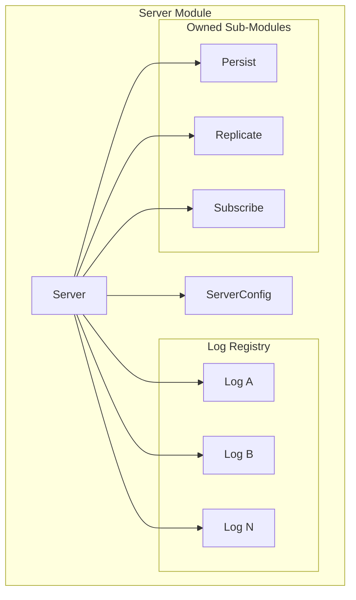
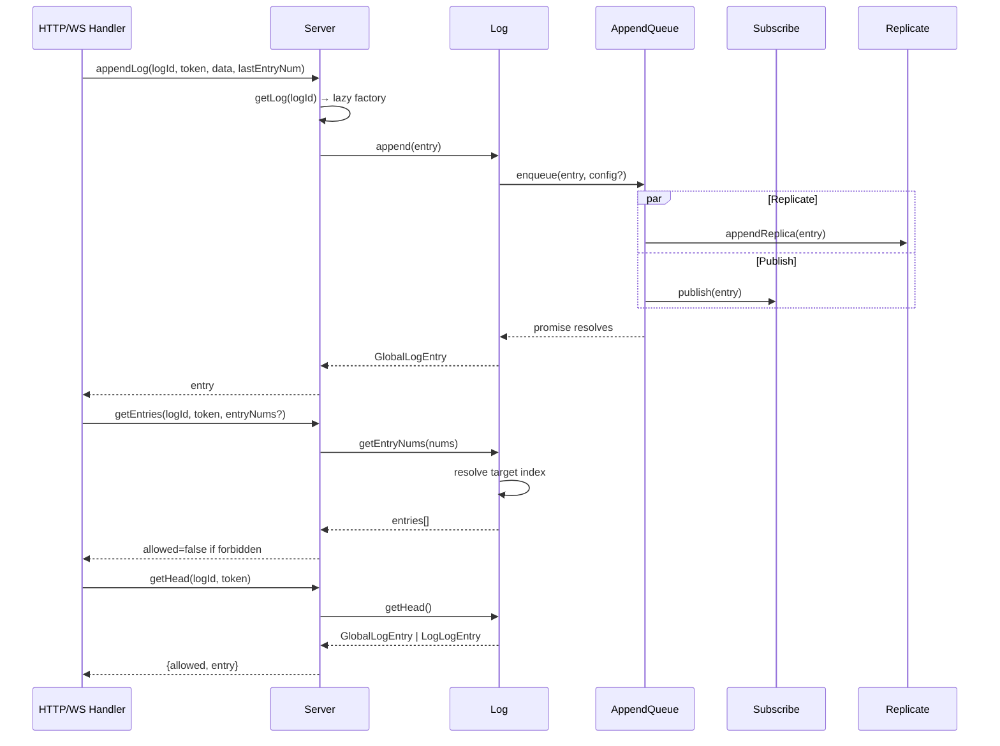

# Server Module — ServerModule.spec.md

## 1. Overview

The **Server Module** is the central orchestrator that ties all sub-modules together. `Server` owns the `Persist`, `Replicate`, and `Subscribe` instances, manages the `Map<string, Log>` registry, and exposes the public API consumed by the HTTP/WS handler layer. `Subscribe` manages uWebSockets pub/sub topics per logId.

**Dependencies:** Log Module (Log, LogConfig, LogId, Access), Persistence Module (Persist), Replication Module (Replicate), Entry Module (entry types)
**Lifecycle stages:** Server.constructor (create sub-modules) → init (Persist.init) → route handlers → delLog / getLog (lazy factory)

## 2. Component Specifications

| Component | Role | Access Path |
|---|---|---|
| `Server` | Central orchestrator — Log registry, public API, sub-module references | `../server.ts` |
| `ServerConfig` | Configuration type — host, dataDir, pageSize, limits, peers, secret | `../server.ts` |
| `Subscribe` | uWebSockets pub/sub manager — subscriptions, publish | `../subscribe.ts` |

## 3. System Architecture



## 4. Detailed Data Flow



## 5. Visualization

```html
<!DOCTYPE html>
<html>
<head>
<meta charset="utf-8">
<style>
  body { font-family: monospace; background: #1e1e2e; color: #cdd6f4; margin: 0; }
  #vis { width: 960px; height: 540px; position: relative; }
  .controls { display: flex; gap: 8px; padding: 8px; background: #181825; align-items: center; }
  .controls button { background: #45475a; color: #cdd6f4; border: none; padding: 4px 12px; cursor: pointer; }
  #kf-current, #kf-total { color: #a6adc8; font-size: 12px; min-width: 20px; text-align: center; }
  #frame-label { color: #89b4fa; font-size: 14px; margin-left: auto; }
  .node { position: absolute; border: 2px solid #89b4fa; border-radius: 6px; padding: 8px 12px;
           background: #313244; font-size: 11px; text-align: center; transition: all 0.3s; }
  .node.active { border-color: #a6e3a1; background: #45475a; box-shadow: 0 0 12px #a6e3a180; }
  .edge { position: absolute; height: 2px; background: #585b70; transform-origin: 0 0; }
  .edge.active { background: #a6e3a1; }
  .badge { font-size: 9px; color: #6c7086; }
</style>
</head>
<body>
<div class="controls">
  <button id="play-pause" data-testid="play-pause">⏸</button>
  <span id="kf-current">0</span><span>/</span><span id="kf-total">5</span>
  <input type="range" id="seek" min="0" max="5" value="0" style="flex:1">
  <span id="frame-label">HTTP handler calls Server.appendLog</span>
</div>
<div id="vis"></div>
<script>
(function(){
  const ANIMATION_DURATION_MS = 10000;
  const ANIMATION_KEYFRAMES = [
    { label: "HTTP handler calls Server.appendLog()", active: ["Handler","S"], edges: ["Handler-S"] },
    { label: "Server.getLog() → lazy factory", active: ["S","L"], edges: ["S-L"] },
    { label: "Log.append() → AppendQueue.enqueue()", active: ["L","AQ"], edges: ["L-AQ"] },
    { label: "Replicate + Persist + Publish in parallel", active: ["AQ","Rep","P","Sub"], edges: ["AQ-Rep","AQ-P","AQ-Sub"] },
    { label: "Promise resolves → response", active: ["S","Handler"], edges: ["S-Handler"] },
  ];
  const nodePositions = {
    Handler: [80, 120], S: [280, 120], L: [480, 60],
    AQ: [680, 60], Rep: [480, 200], P: [680, 200], Sub: [680, 320]
  };

  const vis = document.getElementById('vis');
  Object.entries(nodePositions).forEach(([id, [x, y]]) => {
    const el = document.createElement('div');
    el.className = 'node'; el.id = 'n-' + id;
    el.style.left = x + 'px'; el.style.top = y + 'px';
    el.innerHTML = `<strong>${id}</strong><div class="badge">server</div>`;
    vis.appendChild(el);
  });

  [['Handler','S'],['S','L'],['L','AQ'],['AQ','Rep'],['AQ','P'],['AQ','Sub'],['S','Handler']].forEach(([from, to]) => {
    const fx = nodePositions[from][0] + 40, fy = nodePositions[from][1] + 20;
    const tx = nodePositions[to][0], ty = nodePositions[to][1] + 20;
    const dx = tx - fx, dy = ty - fy;
    const len = Math.sqrt(dx*dx + dy*dy);
    const el = document.createElement('div');
    el.className = 'edge'; el.id = 'e-' + from + '-' + to;
    el.style.left = fx + 'px'; el.style.top = fy + 'px';
    el.style.width = len + 'px';
    el.style.transform = 'rotate(' + (Math.atan2(dy, dx) * 180 / Math.PI) + 'deg)';
    vis.appendChild(el);
  });

  let currentKf = 0, playing = true, intervalId;
  function jumpToKeyframe(idx) {
    currentKf = Math.max(0, Math.min(idx, ANIMATION_KEYFRAMES.length - 1));
    const kf = ANIMATION_KEYFRAMES[currentKf];
    document.querySelectorAll('.node').forEach(n => n.classList.toggle('active', kf.active.includes(n.id.replace('n-',''))));
    document.querySelectorAll('.edge').forEach(e => e.classList.toggle('active', kf.edges?.includes(e.id.replace('e-',''))));
    document.getElementById('frame-label').textContent = kf.label;
    document.getElementById('kf-current').textContent = currentKf;
    document.getElementById('seek').value = currentKf;
  }
  function resetAnimation() { jumpToKeyframe(0); }
  function getAnimationState() { return { currentKf, playing, total: ANIMATION_KEYFRAMES.length }; }
  function togglePlay() {
    playing = !playing;
    document.getElementById('play-pause').textContent = playing ? '⏸' : '▶';
    if (playing) intervalId = setInterval(() => jumpToKeyframe((currentKf+1) % ANIMATION_KEYFRAMES.length), ANIMATION_DURATION_MS / ANIMATION_KEYFRAMES.length);
    else clearInterval(intervalId);
  }
  document.getElementById('play-pause').addEventListener('click', togglePlay);
  document.getElementById('seek').addEventListener('input', function() { jumpToKeyframe(parseInt(this.value)); });
  document.getElementById('kf-total').textContent = ANIMATION_KEYFRAMES.length - 1;
  jumpToKeyframe(0);
  intervalId = setInterval(() => jumpToKeyframe((currentKf+1) % ANIMATION_KEYFRAMES.length), ANIMATION_DURATION_MS / ANIMATION_KEYFRAMES.length);
  window.__ANIMATION = { ANIMATION_KEYFRAMES, ANIMATION_DURATION_MS, jumpToKeyframe, resetAnimation, getAnimationState };
})();
</script>
</body>
</html>
```

## 6. Testing Requirements

| Method / Constructor | Unit test | Validates |
|---|---|---|
| `Server.constructor()` | `server.test.ts` | Config stored, sub-modules created |
| `Server.init()` | same | Persist initialized |
| `Server.getLog()` | same | Lazy factory, cached |
| `Server.delLog()` | same | Removed from registry, stopped |
| `Server.appendLog()` | same | Access validation, read-only check, lastEntryNum check, entry wrapping, master check |
| `Server.appendReplica()` | same | CreateLog route vs append route |
| `Server.createLog()` | same | LogId generation, config validation |
| `Server.getConfig()` | same | Access check, config read |
| `Server.setConfig()` | same | Access check, delegate to Log |
| `Server.getEntries()` | same | entryNums path vs offset/limit path |
| `Server.getHead()` | same | Access check, delegate to Log |
| `Server.deleteLog()` | same | Stub returns false |
| `Subscribe.allowSubscription()` | `subscribe.test.ts` | Read access check |
| `Subscribe.addSubscription()` | same | Topic added |
| `Subscribe.delSubscription()` | same | Topic removed |
| `Subscribe.hasSubscription()` | same | Boolean check |
| `Subscribe.publish()` | same | Entry type serialization (command/json/binary) |

## 7. Source-Test Cross-References

| Source file | Test spec |
|---|---|
| `src/lib/server.ts` | `src/lib/server.test.ts` |
| `src/lib/subscribe.ts` | `src/lib/subscribe.test.ts` |
