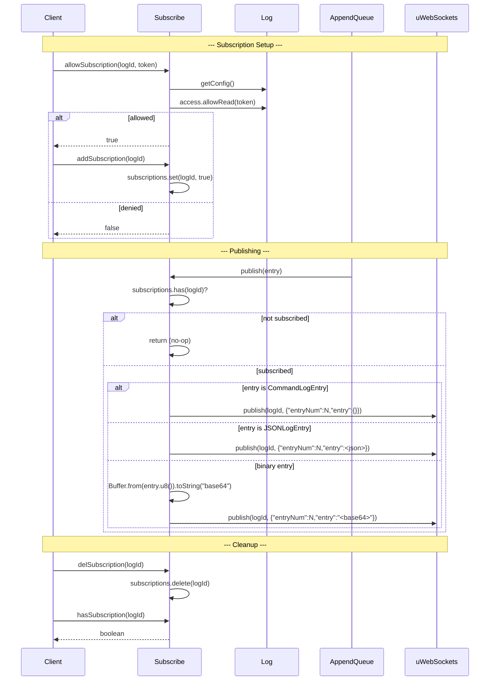

# Subscribe Spec

**Module: Pub/Sub**

## Overview

Manages WebSocket subscriptions for real-time log entry delivery. Tracks subscribed log IDs in a `Map<string, boolean>`. On `publish`, serializes entries as JSON and delegates to `uWebSockets` for fan-out. Supports JSON text entries and binary entries (base64-encoded). Command entries are published with empty entry body.

## Component Specifications

```typescript
class Subscribe {
    server: Server
    subscriptions: Map<string, boolean>   // logId base64 → subscribed
}
```

## System Architecture

```mermaid
graph TB
    AQ[AppendQueue] -->|publish(entry)| Sub[Subscribe]
    Sub -->|check subscription| Subs[subscriptions Map]
    Subs -->|logId present?| Pub[Publish]
    Pub -->|entry instanceof CommandLogEntry| PubCmd[{"entryNum":N,"entry":{}}]
    Pub -->|entry instanceof JSONLogEntry| PubJSON[{"entryNum":N,"entry":<JSON string>}]
    Pub -->|else binary| PubBin[{"entryNum":N,"entry":"<base64>"}]
    PubCmd --> UWS[uWebSockets.publish]
    PubJSON --> UWS
    PubBin --> UWS
    UWS --> Clients[Subscribed WebSocket Clients]

    Client[Client Request] -->|allowSubscription| Sub
    Sub -->|getLog + access.allowRead| Log
    Log --> Allowed{allowed?}
    Allowed -->|yes| OK[return true]
    Allowed -->|no| Deny[return false]

    Client -->|addSubscription| Sub
    Client -->|delSubscription| Sub
    Client -->|hasSubscription| Sub
```

## Detailed Data Flow



## Visualization

```html
<div id="subscribe-viz"></div>
<script src="https://d3js.org/d3.v7.min.js"></script>
<script>
(function() {
    const ANIMATION_DURATION_MS = 4000;
    const ANIMATION_KEYFRAMES = [
        { label: "No Subscriptions", subs: 0, entryType: "-", published: false },
        { label: "Client Subscribes", subs: 1, entryType: "-", published: false },
        { label: "Publish JSON Entry", subs: 1, entryType: "json", published: true },
        { label: "Publish Binary Entry", subs: 1, entryType: "binary", published: true },
        { label: "Publish Command Entry", subs: 1, entryType: "command", published: true },
        { label: "Client Unsubscribes", subs: 0, entryType: "-", published: false },
    ];
    let currentFrame = 0;
    let animationId = null;
    let isPlaying = false;

    const container = d3.select("#subscribe-viz");
    container.html("");

    const svg = container.append("svg").attr("width", 650).attr("height", 200);

    // Subscriber count
    const subG = svg.append("g").attr("transform", "translate(20, 20)");
    subG.append("text").attr("font-size", "14").attr("fill", "#333").text("Subscribers: ");
    subG.append("text").attr("class", "sub-count").attr("x", 105).attr("y", 14)
        .attr("font-size", "14").attr("font-weight", "bold").text("0");

    // Publish status box
    const pubG = svg.append("g").attr("transform", "translate(170, 15)");
    pubG.append("rect").attr("class", "pub-box").attr("width", 200).attr("height", 50)
        .attr("rx", 6).attr("fill", "#e0e0e0").attr("stroke", "#4caf50").attr("stroke-width", 2);
    pubG.append("text").attr("class", "pub-type").attr("x", 100).attr("y", 22)
        .attr("text-anchor", "middle").attr("font-size", "12").attr("font-weight", "bold").attr("fill", "#333").text("No publish");
    pubG.append("text").attr("class", "pub-status").attr("x", 100).attr("y", 40)
        .attr("text-anchor", "middle").attr("font-size", "11").attr("fill", "#666").text("");

    // Visualization of clients
    const clientsG = svg.append("g").attr("transform", "translate(420, 20)");
    clientsG.append("text").attr("font-size", "13").attr("fill", "#666").text("Clients");

    for (let i = 0; i < 3; i++) {
        const c = clientsG.append("g").attr("transform", `translate(${i * 60}, 25)`);
        c.append("circle").attr("class", `client-${i}`).attr("r", 16).attr("fill", "#e0e0e0").attr("stroke", "#999");
        c.append("text").attr("x", 0).attr("y", 4).attr("text-anchor", "middle")
            .attr("font-size", "10").attr("fill", "#666").text(`C${i+1}`);
    }

    // Frame label
    svg.append("text").attr("class", "frame-label").attr("x", 325).attr("y", 180)
        .attr("text-anchor", "middle").attr("font-size", "14").attr("fill", "#333");

    // Controls
    const controls = container.append("div").style("margin-top","10px");
    controls.append("button").attr("data-testid","play-pause").text("▶ Play").on("click", togglePlay);
    controls.append("span").style("margin-left","10px").text("Frame: ");
    controls.append("span").attr("id","kf-total").text("0 / 5");
    controls.append("input").attr("type","range").attr("min",0).attr("max",ANIMATION_KEYFRAMES.length-1).attr("value",0)
        .style("width","300px").style("margin-left","10px").on("input", function() { jumpToKeyframe(+this.value); });

    function update(kf) {
        svg.select("text.sub-count").text(kf.subs);

        if (kf.published) {
            svg.select("rect.pub-box").attr("stroke", "#4caf50").attr("fill", "#e8f5e9");
            svg.select("text.pub-type").text(`Published: ${kf.entryType}`);
            svg.select("text.pub-status").text("✓ sent to UWS");
        } else {
            svg.select("rect.pub-box").attr("stroke", "#999").attr("fill", "#f5f5f5");
            svg.select("text.pub-type").text("No publish");
            svg.select("text.pub-status").text("");
        }

        // Color subscribers
        for (let i = 0; i < 3; i++) {
            svg.select(`circle.client-${i}`).attr("fill", i < kf.subs ? "#4caf50" : "#e0e0e0")
                .attr("stroke", i < kf.subs ? "#2e7d32" : "#999");
        }

        svg.select("text.frame-label").text(kf.label);
        d3.select("#kf-total").text(`${kf.label} (${currentFrame} / ${ANIMATION_KEYFRAMES.length-1})`);
    }

    function togglePlay() {
        isPlaying = !isPlaying;
        d3.select("[data-testid=play-pause]").text(isPlaying ? "⏸ Pause" : "▶ Play");
        if (isPlaying) {
            animationId = setInterval(() => {
                currentFrame = (currentFrame + 1) % ANIMATION_KEYFRAMES.length;
                update(ANIMATION_KEYFRAMES[currentFrame]);
                d3.select("input[type=range]").property("value", currentFrame);
            }, ANIMATION_DURATION_MS / ANIMATION_KEYFRAMES.length);
        } else if (animationId) {
            clearInterval(animationId);
            animationId = null;
        }
    }

    function jumpToKeyframe(frame) {
        if (isPlaying) togglePlay();
        currentFrame = frame;
        update(ANIMATION_KEYFRAMES[frame]);
        d3.select("input[type=range]").property("value", frame);
    }

    function resetAnimation() {
        if (isPlaying) togglePlay();
        jumpToKeyframe(0);
    }

    function getAnimationState() {
        return { currentFrame, totalFrames: ANIMATION_KEYFRAMES.length, isPlaying, keyframe: ANIMATION_KEYFRAMES[currentFrame] };
    }

    update(ANIMATION_KEYFRAMES[0]);
    setTimeout(() => console.log("ANIMATION_VERIFICATION: Subscribe viz loaded, 6 keyframes, ready"), 100);
})();
</script>
```

## Testing Requirements

| # | Test Case | Input | Expected |
|---|-----------|-------|----------|
| 1 | allowSubscription — allowed | Valid token with read access | Returns `true` |
| 2 | allowSubscription — denied | No read access | Returns `false` |
| 3 | addSubscription | `addSubscription("logId")` | `subscriptions.has("logId") === true` |
| 4 | delSubscription | `delSubscription("logId")` | `subscriptions.has("logId") === false` |
| 5 | hasSubscription | Added subscription | Returns `true` |
| 6 | publish — no subscribers | No subscription for logId | No-op, UWS.publish not called |
| 7 | publish — JSON entry | `JSONLogEntry` with json string | Publishes correct JSON (`{"entryNum":N,"entry":<json>}`) |
| 8 | publish — binary entry | BinaryLogEntry | Publishes base64-encoded binary |
| 9 | publish — command entry | CommandLogEntry | Publishes `{"entryNum":N,"entry":{}}` |

---

## 7. Source-Test Cross-References

### Test Coverage

| Test Spec | Path |
|---|---|
| Subscribe.test.spec.md | `source/src/lib/subscribe/Subscribe.test.spec.md` |
