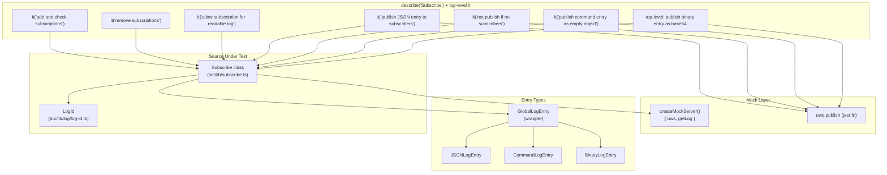
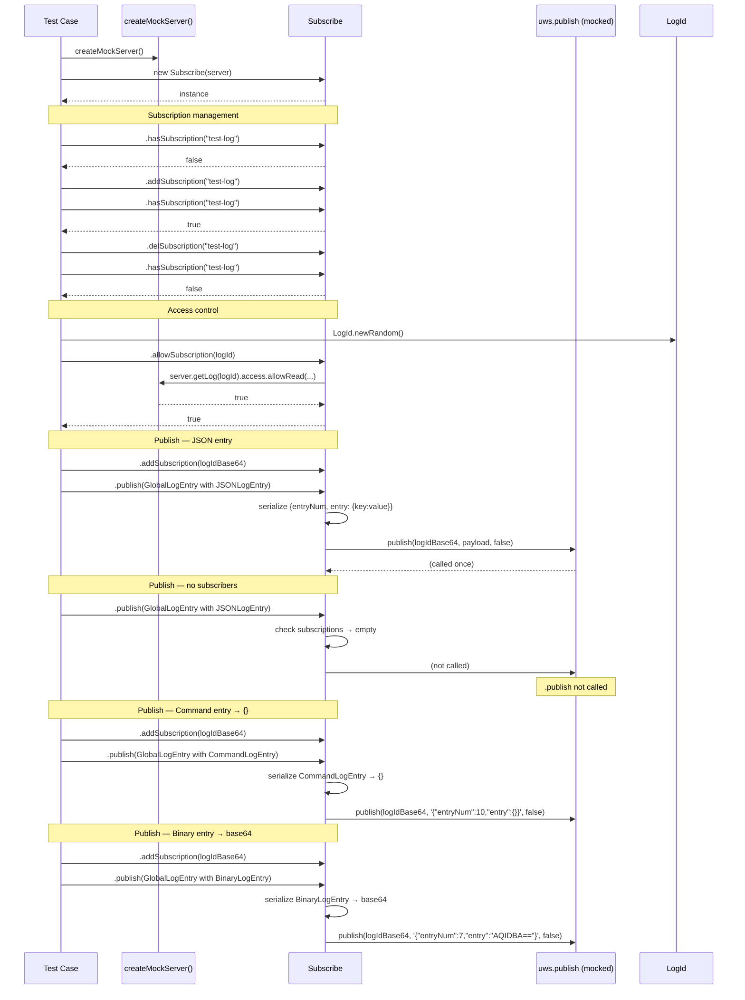

# Subscribe — Test Specification

## Overview

Tests the `Subscribe` class (`src/lib/subscribe.ts`) which manages real-time WebSocket subscriptions — adding/removing subscription channels, checking subscription existence, authorizing read access, and publishing entries (JSON, Command, Binary) to subscribers via uWebSockets.js `publish`. The test suite validates the full publish path for three entry types and confirms no-op behavior when no subscribers exist.

## Component Specifications

| Pattern | Details |
|---|---|
| **Framework** | `@jest/globals` (`describe`/`it`/`expect`/`jest`) |
| **Server mock** | `createMockServer()` — returns `{ uws: { publish: jest.fn() }, getLog: jest.fn(() => ({ getConfig: jest.fn(), access: { allowRead: jest.fn(() => true) } })) }` |
| **Entry types tested** | `GlobalLogEntry` wrapping `JSONLogEntry`, `CommandLogEntry`, `BinaryLogEntry` |
| **Source under test** | `src/lib/subscribe.ts` |
| **Dependencies** | `BinaryLogEntry` (`src/lib/entry/binary-log-entry.ts`), `CommandLogEntry` (`src/lib/entry/command-log-entry.ts`), `GlobalLogEntry` (`src/lib/entry/global-log-entry.ts`), `JSONLogEntry` (`src/lib/entry/json-log-entry.ts`), `LogId` (`src/lib/log/log-id.ts`) |

## System Architecture



## Detailed Data Flow



## Visualization

```d3
<svg id="subscribe-spec-viz" width="800" height="500" viewBox="0 0 800 500" xmlns="http://www.w3.org/2000/svg">
  <style>
    .bar { fill: #8e44ad; transition: all 200ms; }
    .bar-inactive { fill: #bdc3c7; }
    .bar-label { font-family: monospace; font-size: 11px; text-anchor: middle; fill: #333; }
    .axis text { font-family: monospace; font-size: 10px; fill: #666; }
    .axis line, .axis path { stroke: #ccc; stroke-width: 1; }
    .kf-marker { fill: #d35400; }
    .kf-label { font-family: monospace; font-size: 10px; fill: #d35400; text-anchor: middle; }
    .control-btn { font-family: monospace; font-size: 12px; cursor: pointer; fill: #fff; stroke: #8e44ad; stroke-width: 1.5; rx: 4; ry: 4; }
    .control-btn:hover { fill: #f5eefc; }
    .control-text { font-family: monospace; font-size: 11px; text-anchor: middle; fill: #8e44ad; cursor: pointer; user-select: none; }
    #kf-info text { font-family: monospace; font-size: 10px; fill: #555; }
  </style>

  <g transform="translate(60,20)">
    <text x="340" y="18" font-family="monospace" font-size="14" font-weight="bold" text-anchor="middle" fill="#222">Subscribe Test — Subscription &amp; Publish Timeline</text>
    <text x="340" y="34" font-family="monospace" font-size="11" text-anchor="middle" fill="#888">7 keyframes across subscribe lifecycle</text>

    <g class="axis" transform="translate(0,380)">
      <line x1="0" y1="0" x2="680" y2="0"/>
      <text x="0" y="14" text-anchor="middle">noSub</text>
      <text x="97" y="14" text-anchor="middle">addSub</text>
      <text x="194" y="14" text-anchor="middle">delSub</text>
      <text x="291" y="14" text-anchor="middle">allowSub</text>
      <text x="388" y="14" text-anchor="middle">pubJSON</text>
      <text x="485" y="14" text-anchor="middle">pubCmd</text>
      <text x="582" y="14" text-anchor="middle">pubBin</text>
      <text x="680" y="14" text-anchor="middle">noPub</text>
    </g>

    <g class="axis" transform="translate(0,0)">
      <line x1="0" y1="0" x2="0" y2="380"/>
      <text x="-8" y="380" text-anchor="end">0</text>
      <text x="-8" y="128" text-anchor="end">call</text>
    </g>

    <!-- bars: subscription status (top half), publish calls (y=128) -->
    <!-- kf0: hasSubscription=false → 0, no publish -->
    <rect class="bar-inactive" x="0" y="380" width="40" height="0" data-kf="0"/>
    <!-- kf1: addSubscription → 1 -->
    <rect class="bar" x="87" y="268" width="40" height="112" data-kf="1"/>
    <!-- kf2: delSubscription → 0 -->
    <rect class="bar-inactive" x="174" y="380" width="40" height="0" data-kf="2"/>
    <!-- kf3: allowSubscription=true -->
    <rect class="bar" x="261" y="268" width="50" height="112" data-kf="3"/>
    <!-- kf4: publish JSON → 1 call -->
    <rect class="bar" x="358" y="128" width="50" height="252" data-kf="4"/>
    <!-- kf5: publish Command → 1 call -->
    <rect class="bar" x="455" y="128" width="50" height="252" data-kf="5"/>
    <!-- kf6: publish Binary → 1 call -->
    <rect class="bar" x="552" y="128" width="50" height="252" data-kf="6"/>
    <!-- left bar: subscription active during kf4-kf6, kf7: no-sub no-publish -->
    <rect class="bar-inactive" x="650" y="380" width="50" height="0" data-kf="7"/>

    <g>
      <circle class="kf-marker" cx="20" cy="380" r="4"/>
      <text class="kf-label" x="20" y="372">kf0</text>
      <circle class="kf-marker" cx="107" cy="268" r="4"/>
      <text class="kf-label" x="107" y="260">kf1</text>
      <circle class="kf-marker" cx="194" cy="380" r="4"/>
      <text class="kf-label" x="194" y="372">kf2</text>
      <circle class="kf-marker" cx="286" cy="268" r="4"/>
      <text class="kf-label" x="286" y="260">kf3</text>
      <circle class="kf-marker" cx="383" cy="128" r="4"/>
      <text class="kf-label" x="383" y="120">kf4</text>
      <circle class="kf-marker" cx="480" cy="128" r="4"/>
      <text class="kf-label" x="480" y="120">kf5</text>
      <circle class="kf-marker" cx="577" cy="128" r="4"/>
      <text class="kf-label" x="577" y="120">kf6</text>
      <circle class="kf-marker" cx="675" cy="380" r="4"/>
      <text class="kf-label" x="675" y="372">kf7</text>
    </g>

    <g transform="translate(0,420)">
      <rect x="0" y="0" width="12" height="12" fill="#8e44ad"/>
      <text x="16" y="10" font-family="monospace" font-size="10" fill="#555">active / published</text>
      <rect x="130" y="0" width="12" height="12" fill="#bdc3c7"/>
      <text x="146" y="10" font-family="monospace" font-size="10" fill="#555">inactive</text>
    </g>

    <g transform="translate(240,455)">
      <rect class="control-btn" x="0" y="0" width="50" height="22" data-testid="play-pause"/>
      <text class="control-text" x="25" y="15" data-testid="play-pause">▶</text>
      <rect class="control-btn" x="60" y="0" width="70" height="22" id="reset-btn"/>
      <text class="control-text" x="95" y="15" id="reset-btn">↺ reset</text>
      <rect class="control-btn" x="140" y="0" width="36" height="22" id="kf-prev"/>
      <text class="control-text" x="158" y="15" id="kf-prev">◀</text>
      <rect class="control-btn" x="186" y="0" width="36" height="22" id="kf-next"/>
      <text class="control-text" x="204" y="15" id="kf-next">▶</text>
    </g>

    <g id="kf-info" transform="translate(490,458)">
      <text>KF: <tspan id="kf-current">0</tspan> / <tspan id="kf-total">7</tspan></text>
    </g>
  </g>
</svg>
<script>
  (function() {
    const ANIMATION_DURATION_MS = 300;
    const ANIMATION_KEYFRAMES = 8;
    var ANIMATION_VERIFICATION = { ran: false };
    var animFrame = null;
    var currentKF = 0;
    var playing = false;
    var animationState = 'idle';

    function getAnimationState() { return animationState; }

    function jumpToKeyframe(kf) {
      if (kf < 0 || kf >= ANIMATION_KEYFRAMES) return;
      currentKF = kf;
      document.querySelectorAll('[data-kf]').forEach(function(el) {
        var kfVal = parseInt(el.getAttribute('data-kf'));
        if (kfVal <= currentKF) {
          el.style.opacity = '';
        } else {
          el.style.opacity = '0.06';
        }
      });
      document.getElementById('kf-current').textContent = currentKF;
      ANIMATION_VERIFICATION.ran = true;
      ANIMATION_VERIFICATION.lastKF = currentKF;
    }

    function resetAnimation() {
      playing = false;
      animationState = 'idle';
      document.querySelector('[data-testid="play-pause"]').textContent = '▶';
      if (animFrame) { clearInterval(animFrame); animFrame = null; }
      jumpToKeyframe(0);
    }

    jumpToKeyframe(0);

    document.querySelector('[data-testid="play-pause"]').addEventListener('click', function() {
      if (playing) {
        playing = false;
        animationState = 'paused';
        this.textContent = '▶';
        if (animFrame) { clearInterval(animFrame); animFrame = null; }
      } else {
        playing = true;
        animationState = 'playing';
        this.textContent = '⏸';
        animFrame = setInterval(function() {
          if (currentKF < ANIMATION_KEYFRAMES - 1) {
            jumpToKeyframe(currentKF + 1);
          } else {
            playing = false;
            animationState = 'idle';
            clearInterval(animFrame);
            animFrame = null;
            document.querySelector('[data-testid="play-pause"]').textContent = '▶';
          }
        }, ANIMATION_DURATION_MS);
      }
    });

    document.getElementById('reset-btn').addEventListener('click', resetAnimation);

    document.getElementById('kf-prev').addEventListener('click', function() {
      if (playing) return;
      jumpToKeyframe(currentKF - 1);
    });

    document.getElementById('kf-next').addEventListener('click', function() {
      if (playing) return;
      jumpToKeyframe(currentKF + 1);
    });
  })();
</script>
```

## Testing Requirements

| # | Requirement | How verified |
|---|---|---|
| 1 | `hasSubscription` returns `false` for unknown log | Assert `false` before any `addSubscription` |
| 2 | `addSubscription` registers a log for publishing | Assert `hasSubscription` returns `true` after add |
| 3 | `delSubscription` removes a log from subscriptions | Assert `hasSubscription` returns `false` after delete |
| 4 | `allowSubscription` checks read access via `server.getLog(...).access.allowRead` | Assert returns `true` when mock allows |
| 5 | `publish` with `JSONLogEntry` sends JSON payload via `uws.publish` | Assert called with `logIdBase64`, correctly serialized JSON, `false` |
| 6 | `publish` with no subscribers does NOT call `uws.publish` | Assert `.not.toHaveBeenCalled()` |
| 7 | `publish` with `CommandLogEntry` serializes to `{}` | Assert payload contains `"entry":{}` |
| 8 | `publish` with `BinaryLogEntry` base64-encodes binary data | Assert payload contains base64 string (not raw binary) |

---

## 7. Source-Test Cross-References

### Source Coverage

| Source Spec | Path |
|---|---|
| Subscribe.spec.md | `source/src/lib/subscribe/Subscribe.spec.md` |
