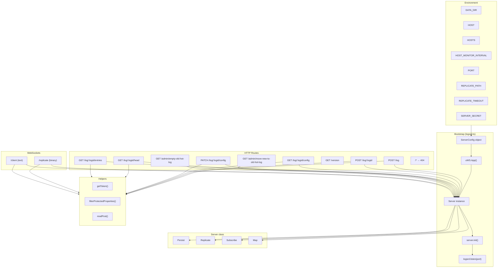
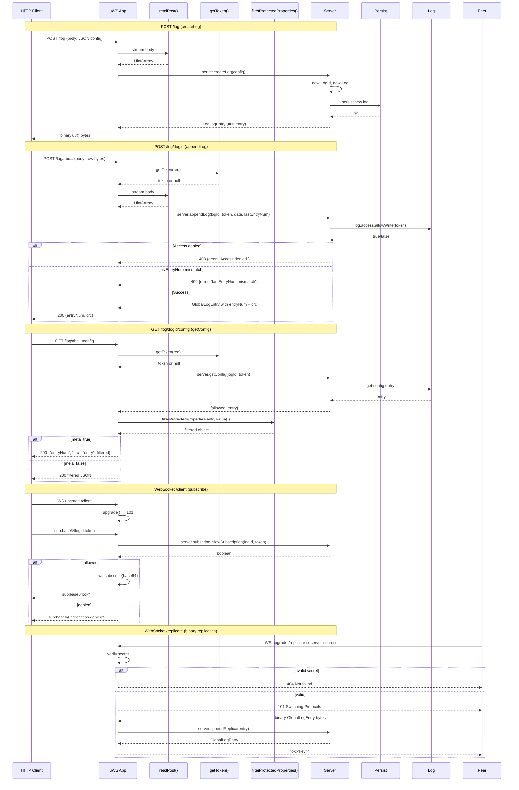

# Logsrd — Main Entry Point Specification

**Module: Entry Point**

## 1. Overview

`logsrd.ts` is the bootstrap and HTTP/WS route configuration module. It:

- Parses environment variables into a `ServerConfig` object.
- Creates a uWebSockets.js `TemplatedApp` instance.
- Instantiates the `Server` class which owns persistence, replication, and subscription subsystems.
- Registers all public HTTP routes (log CRUD), two WebSocket endpoints (replication + client), an admin test-helper route group, version endpoint, and a catch-all 404 handler.
- Calls `server.init()` to load existing log state from disk, then starts listening on the configured port.

### Environment Variables

| Variable | Default | Description |
|---|---|---|
| `DATA_DIR` | `"./data"` | Root data directory for logs/blobs |
| `HOST` | `"127.0.0.1"` | Bind address |
| `HOSTS` | `""` | Space-separated peer host list for replication |
| `HOST_MONITOR_INTERVAL` | `10000` | Peer health-check interval (ms) |
| `PORT` | `7000` | HTTP/WS listen port |
| `REPLICATE_PATH` | `"/replicate"` | WebSocket path for replication |
| `REPLICATE_TIMEOUT` | `3000` | Replication connection timeout (ms) |
| `SERVER_SECRET` | `"secret"` | Shared secret for replication auth |

---

## 2. Component Specifications

### 2.1 Error/Info String Constants

| Identifier | Value | Used By |
|---|---|---|
| `JSON_REQUIRED_ERROR` | `"Content-Type: application/json required"` | — |
| `LOG_CREATE_ERROR` | `"Failed to create log"` | — |
| `INVALID_JSON_POST_ERROR` | `"Invalid JSON"` | createLog, setConfig |
| `INVALID_LOG_ID_ERROR` | `"Invalid log id"` | appendLog, getConfig, setConfig, getHead, getEntries |
| `LOG_NOT_FOUND_ERROR` | `"Log not found"` | — |
| `LOG_OR_HEAD_NOT_FOUND_ERROR` | `"Log not found or log has no entries"` | — |
| `SERVER_ERROR` | `"Server error"` | — |
| `MAX_POST_SIZE_ERROR` | `"Max post size ${MAX_ENTRY_SIZE} bytes exceeded"` | createLog, appendLog, setConfig |
| `INVALID_ENTRY_TYPE_ERROR` | `"Invalid entry type"` | — |
| `INVALID_LOG_TYPE_ERROR` | `"Invalid log type"` | getEntries |
| `INVALID_LAST_ENTRY_NUM_ERROR` | `"Invalid lastEntryNum"` | appendLog |
| `INVALID_LAST_CONFIG_NUM_ERROR` | `"Invalid lastConfigNum"` | setConfig |
| `NO_ENTRIES_INFO` | `"No entries"` | — |

### 2.2 `run()` — Bootstrap Entry

| Aspect | Description |
|---|---|
| Signature | `async function run(): Promise<void>` |
| Role | Builds config, creates uWS app, instantiates Server, registers routes, starts listener |
| Calls | `new Server(config, logsrd)`, `server.init()`, `logsrd.listen(port, …)` |
| Throws | Any uncaught rejection — caught by top-level `run().catch(console.error)` |

### 2.3 Route Handlers

#### `POST /log` — createLog

| Aspect | Description |
|---|---|
| Signature | `async function createLog(server, res, req)` |
| Body | JSON config object (may be empty `{}`) |
| Success 200 | Binary `LogLogEntry.u8()` bytes |
| Error 400 | `MAX_POST_SIZE_ERROR`, `INVALID_JSON_POST_ERROR`, or schema validation error JSON |
| Notes | Calls `server.createLog(config)` which creates a new log + first entry |

#### `POST /log/:logid` — appendLog

| Aspect | Description |
|---|---|
| Signature | `async function appendLog(server, res, req)` |
| Param | `logid` — 22-char base64 LogId |
| Header | `Authorization: Bearer <token>` |
| Query | `?lastEntryNum=<int>` (optional, enables optimistic concurrency) |
| Body | Raw entry bytes (`Uint8Array`) |
| Success 200 | `{"entryNum": <n>, "crc": <n>}` |
| Error 403 | `{"error": "Access denied"}` |
| Error 404 | `{"error": "Invalid log id"}` |
| Error 409 | `{"error": "lastEntryNum mismatch"}` |
| Error 400 | `MAX_POST_SIZE_ERROR`, `INVALID_LAST_ENTRY_NUM_ERROR`, or generic error |

#### `GET /log/:logid/config` — getConfig

| Aspect | Description |
|---|---|
| Signature | `async function getConfig(server, res, req)` |
| Query | `?meta=true` wraps result in `{"entryNum", "crc", "entry": …}` |
| Success 200 | JSON config object (protected properties filtered) |
| Response type | Determined by `Content-Type` header — JSON object vs plain-text error |

#### `PATCH /log/:logid/config` — setConfig

| Aspect | Description |
|---|---|
| Signature | `async function setConfig(server, res, req)` |
| Query | `?lastConfigNum=<int>` (required, OCC guard) |
| Body | JSON partial config |
| Success 200 | Full config JSON (protected filtered) |
| Error 403 | `{"error": "Access denied"}` |
| Error 409 | `{"error": "lastConfigNum mismatch"}` |

#### `GET /log/:logid/head` — getHead

| Aspect | Description |
|---|---|
| Signature | `async function getHead(server, res, req)` |
| Behaviour | Returns latest entry; different serialisation for `CommandLogEntry` vs raw binary; respects `allowed.admin`/`allowed.read` |

#### `GET /log/:logid/entries` — getEntries

| Aspect | Description |
|---|---|
| Signature | `async function getEntries(server, res, req)` |
| Query | `?offset=<n>&limit=<n>&entryNums=<csv>&meta=true` |
| Behaviour | JSON logs → JSON array; binary logs → concatenated binary. Respects access control per entry. |

#### `GET /version`

| Aspect | Description |
|---|---|
| Behaviour | Returns static `"0.0.1"` string |

#### Admin Routes

| Route | Handler | Server method called |
|---|---|---|
| `GET /admin/move-new-to-old-hot-log` | `adminMoveNewToOldHotLog` | `server.persist.moveNewToOldHotLog()` |
| `GET /admin/empty-old-hot-log` | `adminEmptyOldHotLog` | `server.persist.emptyOldHotLog()` |

#### Catch-all

`/*` → 404 `"Not found"`

### 2.4 WebSocket Endpoints

#### `/replicate` — Replication WebSocket

| Aspect | Description |
|---|---|
| Auth | `x-server-secret` header must match `SERVER_SECRET` |
| Binary messages | Deserialised via `GlobalLogEntryFactory.fromU8()`, passed to `server.appendReplica()` |
| Response | `ok:<key>` on success, `err:<key>:<message>` on failure |

#### `/client` — Client Subscription WebSocket

| Aspect | Description |
|---|---|
| Auth | None currently (TODO) |
| Text messages | `sub:<base64>:<token>` / `unsub:<base64>` |
| Binary messages | Not yet implemented |
| Subscription lifecycle | `subscription` callback maintains `server.subscribe` registry |

### 2.5 Helper Functions

#### `getToken(req): string | null`

Parses `Authorization` header; returns Bearer token value or null.

#### `filterProtectedProperties(obj): object`

Removes keys listed in `ProtectedProperties` array from the object.

#### `readPost(res, cb)`

Streams POST body via uWS `onData` callback. Tracks buffers manually across chunk boundaries, enforces `MAX_ENTRY_SIZE` limit (hard-closes connection on violation), and delivers the complete `Uint8Array` to `cb`.

---

## 3. System Architecture



---

## 4. Detailed Data Flow



---

## 5. Visualization

```html
<!DOCTYPE html>
<html lang="en">
<head>
<meta charset="UTF-8" />
<title>logsrd.ts — Bootstrap & Route Visualizer</title>
<style>
* { box-sizing: border-box; margin: 0; padding: 0; }
body { font-family: system-ui, sans-serif; background: #0d1117; color: #c9d1d9; padding: 20px; }
h1 { color: #58a6ff; margin-bottom: 8px; }
p.sub { color: #8b949e; margin-bottom: 20px; font-size: 14px; }
.toolbar { display: flex; gap: 12px; align-items: center; margin-bottom: 16px; flex-wrap: wrap; }
.toolbar button { background: #21262d; color: #c9d1d9; border: 1px solid #30363d; padding: 6px 14px; border-radius: 6px; cursor: pointer; font-size: 13px; }
.toolbar button:hover { background: #30363d; }
.toolbar button.active { background: #1f6feb; border-color: #1f6feb; }
.toolbar span { color: #8b949e; font-size: 13px; }
.toolbar input[type="range"] { width: 300px; accent-color: #58a6ff; }
#vis { position: relative; background: #161b22; border: 1px solid #30363d; border-radius: 8px; overflow: hidden; }
#vis svg { display: block; width: 100%; height: auto; }
.info { display: grid; grid-template-columns: 1fr 1fr; gap: 16px; margin-top: 16px; }
.card { background: #161b22; border: 1px solid #30363d; border-radius: 8px; padding: 14px; }
.card h3 { color: #58a6ff; font-size: 14px; margin-bottom: 8px; }
.card pre { font-size: 12px; color: #8b949e; white-space: pre-wrap; }
</style>
</head>
<body>
<h1>logsrd.ts — Bootstrap &amp; Route Architecture</h1>
<p class="sub">Interactive D3.js animation — each keyframe highlights a stage in the startup and route registration flow.</p>

<div class="toolbar">
  <button id="play-btn" data-testid="play-pause">▶ Play</button>
  <button id="reset-btn">↺ Reset</button>
  <span>Keyframe: <span id="kf-current">0</span> / <span id="kf-total">0</span></span>
  <input type="range" id="kf-slider" min="0" max="0" value="0" />
  <span id="kf-label">Start</span>
</div>

<div id="vis"></div>

<div class="info">
  <div class="card">
    <h3>Animation State</h3>
    <pre id="state-display">{}</pre>
  </div>
  <div class="card">
    <h3>Keyframe Description</h3>
    <pre id="kf-desc">—</pre>
  </div>
</div>

<script src="https://d3js.org/d3.v7.min.js"></script>
<script>
(function() {
  // ── Keyframes ────────────────────────────────────────────────
  const KEYFRAMES = [
    { label: "Env Config", desc: "Parse DATA_DIR, HOST, PORT, REPLICATE_PATH, SERVER_SECRET from environment", highlights: ["env"] },
    { label: "uWS App", desc: "Create uWS.TemplatedApp instance", highlights: ["uws"] },
    { label: "Server Init", desc: "new Server(config, uws) → instantiate Persist, Replicate, Subscribe; await server.init() loads state from disk", highlights: ["server"] },
    { label: "POST /log", desc: "Register POST /log → createLog: readPost + server.createLog()", highlights: ["post-log"] },
    { label: "POST /log/:logid", desc: "Register POST /log/:logid → appendLog: token extraction, lastEntryNum OCC, readPost + server.appendLog()", highlights: ["post-logid"] },
    { label: "GET config", desc: "Register GET /log/:logid/config → getConfig: token, filterProtectedProperties, meta wrapper", highlights: ["get-config"] },
    { label: "PATCH config", desc: "Register PATCH /log/:logid/config → setConfig: lastConfigNum OCC, readPost, server.setConfig()", highlights: ["patch-config"] },
    { label: "GET head", desc: "Register GET /log/:logid/head → getHead: access-aware CommandLogEntry vs binary response", highlights: ["get-head"] },
    { label: "GET entries", desc: "Register GET /log/:logid/entries → getEntries: JSON array vs binary concatenation, offset/limit/entryNums", highlights: ["get-entries"] },
    { label: "WS /replicate", desc: "Register WS /replicate: upgrade secret check, binary GlobalLogEntry → server.appendReplica()", highlights: ["ws-replicate"] },
    { label: "WS /client", desc: "Register WS /client: sub/unsub protocol, subscription lifecycle callbacks", highlights: ["ws-client"] },
    { label: "Version & Admin", desc: "Register GET /version, GET /admin/* test helpers, catch-all 404", highlights: ["admin"] },
    { label: "Listen", desc: "logsrd.listen(port) — server starts accepting connections", highlights: ["listen"] },
  ];

  window.ANIMATION_DURATION_MS = 300;
  window.ANIMATION_KEYFRAMES = KEYFRAMES;
  window.ANIMATION_VERIFICATION = "3.0.0";

  // ── State ────────────────────────────────────────────────────
  let playing = false;
  let currentIdx = 0;
  let timer = null;

  // ── DOM refs ─────────────────────────────────────────────────
  const playBtn = document.getElementById("play-btn");
  const resetBtn = document.getElementById("reset-btn");
  const kfCurrent = document.getElementById("kf-current");
  const kfTotal = document.getElementById("kf-total");
  const kfSlider = document.getElementById("kf-slider");
  const kfLabel = document.getElementById("kf-label");
  const kfDesc = document.getElementById("kf-desc");
  const stateDisplay = document.getElementById("state-display");
  const vis = document.getElementById("vis");

  kfTotal.textContent = KEYFRAMES.length;
  kfSlider.max = KEYFRAMES.length - 1;

  // ── SVG builder ──────────────────────────────────────────────
  const NODE_W = 160, NODE_H = 44, GAP_X = 80, GAP_Y = 30;
  const LAYERS = [
    { label: "Environment", id: "env", nodes: [
      { id: "env", label: "env vars", x: 0, y: 0 }
    ]},
    { label: "Bootstrap", id: "bootstrap", nodes: [
      { id: "config", label: "ServerConfig", x: 0, y: 0 },
      { id: "uws", label: "uWS.App()", x: NODE_W + GAP_X, y: 0 },
    ]},
    { label: "Server", id: "server", nodes: [
      { id: "server", label: "Server", x: 0, y: 0 },
      { id: "persist", label: "Persist", x: NODE_W + GAP_X, y: 0 },
      { id: "replicate", label: "Replicate", x: 2*(NODE_W + GAP_X), y: 0 },
      { id: "subscribe", label: "Subscribe", x: 3*(NODE_W + GAP_X), y: 0 },
    ]},
    { label: "Routes", id: "routes", nodes: [
      { id: "post-log", label: "POST /log", x: 0, y: 0 },
      { id: "post-logid", label: "POST /log/:logid", x: NODE_W + GAP_X, y: 0 },
      { id: "get-config", label: "GET /log/:logid/config", x: 2*(NODE_W + GAP_X), y: 0 },
      { id: "patch-config", label: "PATCH /log/:logid/config", x: 3*(NODE_W + GAP_X), y: 0 },
    ]},
    { label: "Routes (cont.)", id: "routes2", nodes: [
      { id: "get-head", label: "GET /log/:logid/head", x: 0, y: 0 },
      { id: "get-entries", label: "GET /log/:logid/entries", x: NODE_W + GAP_X, y: 0 },
      { id: "ws-replicate", label: "WS /replicate", x: 2*(NODE_W + GAP_X), y: 0 },
      { id: "ws-client", label: "WS /client", x: 3*(NODE_W + GAP_X), y: 0 },
    ]},
    { label: "Misc", id: "misc", nodes: [
      { id: "admin", label: "Version / Admin", x: 0, y: 0 },
      { id: "listen", label: "Listen :port", x: NODE_W + GAP_X, y: 0 },
    ]},
  ];

  // Pre-compute absolute positions
  const allNodes = {};
  const edges = [];
  let svgW = 0, svgH = 0;

  // ── Build full SVG ───────────────────────────────────────────
  function buildSvg() {
    const pad = { t: 20, r: 40, b: 20, l: 40 };
    let y = pad.t;
    const layerPositions = [];

    for (const layer of LAYERS) {
      const maxX = Math.max(...layer.nodes.map(n => n.x)) + NODE_W;
      const layerW = maxX + pad.r;
      let nodeY = y + 28;
      for (const n of layer.nodes) {
        allNodes[n.id] = { ...n, y: nodeY };
      }
      const layerH = NODE_H + GAP_Y + 6;
      layerPositions.push({ y, h: layerH, label: layer.label, id: layer.id });
      y += layerH;
    }

    // Edges between layers
    const prevLayerNodes = [];
    for (const layer of LAYERS) {
      const curNodes = layer.nodes.map(n => n.id);
      if (prevLayerNodes.length && curNodes.length) {
        for (const src of prevLayerNodes) {
          for (const dst of curNodes) {
            edges.push({ src, dst });
          }
        }
      }
      prevLayerNodes.length = 0;
      prevLayerNodes.push(...curNodes);
    }
    // Route nodes → server edges (all routes connect to server)
    const routeIds = ["post-log","post-logid","get-config","patch-config","get-head","get-entries","ws-replicate","ws-client","admin"];
    for (const rid of routeIds) {
      edges.push({ src: "server", dst: rid });
    }

    svgW = 4*(NODE_W + GAP_X) + pad.l + pad.r;
    svgH = y;

    const svg = d3.select(vis).append("svg")
      .attr("width", svgW)
      .attr("height", svgH)
      .attr("viewBox", `0 0 ${svgW} ${svgH}`);

    // Layer backgrounds
    for (const lp of layerPositions) {
      svg.append("rect")
        .attr("x", 0).attr("y", lp.y)
        .attr("width", svgW).attr("height", lp.h)
        .attr("fill", "#0d1117")
        .attr("stroke", "#21262d")
        .attr("stroke-width", 0.5)
        .attr("data-layer", lp.id);
      svg.append("text")
        .attr("x", 12).attr("y", lp.y + 18)
        .attr("fill", "#8b949e").attr("font-size", 11).attr("font-family", "system-ui")
        .text(lp.label);
    }

    // Edges
    for (const e of edges) {
      const src = allNodes[e.src];
      const dst = allNodes[e.dst];
      if (!src || !dst) continue;
      svg.append("line")
        .attr("class", "edge")
        .attr("data-edge", `${e.src}→${e.dst}`)
        .attr("x1", src.x + NODE_W/2).attr("y1", src.y + NODE_H)
        .attr("x2", dst.x + NODE_W/2).attr("y2", dst.y)
        .attr("stroke", "#30363d").attr("stroke-width", 1.5)
        .attr("opacity", 0.2);
    }

    // Nodes
    for (const [id, n] of Object.entries(allNodes)) {
      const g = svg.append("g")
        .attr("data-node", id)
        .attr("transform", `translate(${n.x},${n.y})`);

      g.append("rect")
        .attr("width", NODE_W).attr("height", NODE_H)
        .attr("rx", 6)
        .attr("fill", "#21262d")
        .attr("stroke", "#30363d")
        .attr("stroke-width", 1);

      g.append("text")
        .attr("x", NODE_W/2).attr("y", NODE_H/2 + 5)
        .attr("text-anchor", "middle")
        .attr("fill", "#c9d1d9").attr("font-size", 12).attr("font-family", "system-ui")
        .text(n.label);
    }

    // Initial dim
    applyHighlights([]);
  }

  function applyHighlights(ids) {
    d3.selectAll("[data-node]").select("rect")
      .attr("fill", n => ids.includes(d3.select(n).attr("data-node")) ? "#1f6feb" : "#21262d")
      .attr("stroke", n => ids.includes(d3.select(n).attr("data-node")) ? "#58a6ff" : "#30363d");
    d3.selectAll(".edge")
      .attr("opacity", d => {
        const eid = `${d.src}→${d.dst}`;
        const highlighted = ids.includes(d.src) || ids.includes(d.dst);
        return highlighted ? 0.6 : 0.1;
      })
      .attr("stroke", d => {
        const highlighted = ids.includes(d.src) || ids.includes(d.dst);
        return highlighted ? "#58a6ff" : "#30363d";
      });
  }

  // ── Public API ───────────────────────────────────────────────
  window.jumpToKeyframe = function(idx) {
    if (idx < 0 || idx >= KEYFRAMES.length) return;
    currentIdx = idx;
    const kf = KEYFRAMES[idx];
    kfCurrent.textContent = idx;
    kfSlider.value = idx;
    kfLabel.textContent = kf.label;
    kfDesc.textContent = kf.desc;
    applyHighlights(kf.highlights);
    updateState();
  };

  window.resetAnimation = function() {
    if (timer) { clearInterval(timer); timer = null; }
    playing = false;
    playBtn.textContent = "▶ Play";
    playBtn.classList.remove("active");
    window.jumpToKeyframe(0);
  };

  window.getAnimationState = function() {
    return {
      currentKeyframe: currentIdx,
      totalKeyframes: KEYFRAMES.length,
      playing,
      keyframe: KEYFRAMES[currentIdx],
    };
  };

  function updateState() {
    stateDisplay.textContent = JSON.stringify(window.getAnimationState(), null, 2);
  }

  function play() {
    if (playing) {
      if (timer) { clearInterval(timer); timer = null; }
      playing = false;
      playBtn.textContent = "▶ Play";
      playBtn.classList.remove("active");
      return;
    }
    playing = true;
    playBtn.textContent = "⏸ Pause";
    playBtn.classList.add("active");
    timer = setInterval(() => {
      let next = currentIdx + 1;
      if (next >= KEYFRAMES.length) {
        next = 0;
      }
      window.jumpToKeyframe(next);
    }, window.ANIMATION_DURATION_MS);
  }

  // ── Init ─────────────────────────────────────────────────────
  buildSvg();
  window.jumpToKeyframe(0);

  // ── Event wiring ─────────────────────────────────────────────
  playBtn.addEventListener("click", play);
  resetBtn.addEventListener("click", window.resetAnimation);
  kfSlider.addEventListener("input", () => {
    const idx = parseInt(kfSlider.value);
    if (idx !== currentIdx) {
      if (playing) play(); // pause
      window.jumpToKeyframe(idx);
    }
  });
})();
</script>
</body>
</html>
```

---

## 6. Testing Requirements

### 6.1 Integration Tests — HTTP Routes

| Test | Route | Verification |
|---|---|---|
| Create log with empty body | `POST /log` `{}` | 200, response starts with log entry magic bytes |
| Create log with valid config | `POST /log` `{"type":"json"}` | 200 |
| Create log with invalid config | `POST /log` `not-json` | 400, `{"error":"Invalid JSON"}` |
| Create log oversized body | `POST /log` (body > MAX_ENTRY_SIZE) | Connection closed |
| Append entry to log | `POST /log/:logid` (binary body) | 200, `{"entryNum":0,"crc":…}` |
| Append with invalid log id | `POST /log/short` | 404, `{"error":"Invalid log id"}` |
| Append with OCC match | `POST /log/:logid?lastEntryNum=0` | 200 |
| Append with OCC mismatch | `POST /log/:logid?lastEntryNum=999` | 409, `{"error":"lastEntryNum mismatch"}` |
| Append with invalid lastEntryNum | `POST /log/:logid?lastEntryNum=abc` | 400, `{"error":"Invalid lastEntryNum"}` |
| Append with access denied | `POST /log/:logid` (no token, private log) | 403, `{"error":"Access denied"}` |
| Get config | `GET /log/:logid/config` | 200, JSON config object |
| Get config invalid id | `GET /log/short/config` | 404, `Invalid log id` |
| Get config with meta | `GET /log/:logid/config?meta=true` | 200, `{"entryNum":…,"crc":…,"entry":…}` |
| Patch config | `PATCH /log/:logid/config?lastConfigNum=0` (body) | 200, updated config JSON |
| Patch config OCC mismatch | `PATCH /log/:logid/config?lastConfigNum=999` | 409 |
| Patch config missing lastConfigNum | `PATCH /log/:logid/config` | 400 |
| Get head | `GET /log/:logid/head` | 200, head entry content |
| Get head with meta | `GET /log/:logid/head?meta=true` | 200, wrapped entry |
| Get entries (JSON log) | `GET /log/:logid/entries` | 200, `Content-Type: application/json`, JSON array |
| Get entries (binary log) | `GET /log/:logid/entries` | 200, concatenated binary |
| Get entries with offset/limit | `GET /log/:logid/entries?offset=0&limit=10` | 200, ≤10 entries |
| Get entries with entryNums | `GET /log/:logid/entries?entryNums=0,2` | 200, specific entries |
| Get version | `GET /version` | 200, `"0.0.1"` |
| 404 catch-all | `GET /nonexistent` | 404, `"Not found"` |

### 6.2 Integration Tests — WebSocket Routes

| Test | Verification |
|---|---|
| Replicate WS valid secret | Upgrade 101, binary message round-trip → `ok:` response |
| Replicate WS invalid secret | Upgrade rejected, 404 |
| Replicate WS invalid entry binary | Response `err:unknown:<msg>` |
| Client WS subscribe | `sub:base64:token` → `sub:base64:ok` |
| Client WS subscribe denied | `sub:base64:bad_token` → `sub:base64:err:access denied` |
| Client WS unsubscribe | `unsub:base64` → `unsub:base64:ok` |
| Client WS invalid log id | `sub:short` → error |
| Client WS unknown command | `bogus:…` → `err:not implemented` |
| Client subscription callback | Verify `server.subscribe.addSubscription` / `delSubscription` called on topic count changes |

### 6.3 Environment Variable Parsing

| Input | Expected Config Value |
|---|---|
| `DATA_DIR=/data` | `config.dataDir === "/data"` |
| `HOST=0.0.0.0` | `config.host === "0.0.0.0:7000"` |
| `PORT=9000` | `config.host === "127.0.0.1:9000"` |
| `HOSTS="10.0.0.1 10.0.0.2"` | `config.hosts === ["10.0.0.1","10.0.0.2"]` |
| `HOST_MONITOR_INTERVAL=5000` | `config.hostMonitorInterval === 5000` |
| `REPLICATE_PATH=/sync` | WS path `/sync` |
| `REPLICATE_TIMEOUT=1000` | `config.replicateTimeout === 1000` |
| `SERVER_SECRET=mysecret` | `config.secret === "mysecret"` |
| All unset | Defaults: `./data`, `127.0.0.1:7000`, `[]`, `10000`, `/replicate`, `3000`, `secret` |

### 6.4 Helper Function Tests

| Function | Test | Expected |
|---|---|---|
| `getToken` | `Authorization: Bearer xyz` | `"xyz"` |
| `getToken` | No `Authorization` header | `null` |
| `getToken` | `Authorization: Basic …` | `null` |
| `filterProtectedProperties` | Object with `{"public":1, "secret":2}`, `ProtectedProperties=["secret"]` | `{"public":1}` |
| `filterProtectedProperties` | Empty object | `{}` |
| `readPost` | Single-chunk body ≤ MAX_ENTRY_SIZE | `cb` called with `Uint8Array` |
| `readPost` | Multi-chunk body ≤ MAX_ENTRY_SIZE | `cb` called with concatenated `Uint8Array` |
| `readPost` | Body exceeding MAX_ENTRY_SIZE | `res.close()` invoked |

### 6.5 Error Cases

| Scenario | Expected Behaviour |
|---|---|
| Request aborted mid-stream | `res.aborted` check prevents double-write |
| `server.appendLog` throws non-standard error | 400 with `{error, stack}` |
| `server.setConfig` throws non-standard error | 400 with `{error, stack}` |
| `server.getConfig` throws | 400 with error message |
| Log with unknown config type | `getEntries` returns 404 `Invalid log type` |
| Admin route on production (routes disabled) | 404 (if routes are removed from registration) |

---

## 7. Source-Test Cross-References

### Test Coverage

| Test Spec | Path |
|---|---|
| No test spec | |
