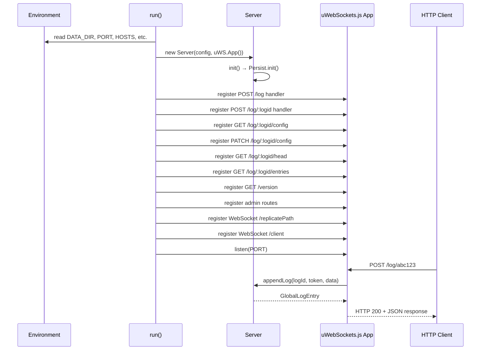

# Entry Point — LogsrdModule.spec.md

## 1. Overview

The **Entry Point Module** is the application bootstrap — `src/logsrd.ts`. It creates a `Server` instance, configures a uWebSockets.js HTTP/WebSocket server, and registers all REST and WebSocket route handlers. It is the **top-most orchestration layer** that imports from every other sub-module.

**Dependencies:** Server Module (Server, ServerConfig environment), all other sub-modules transitively
**Lifecycle stages:** `run()` → Read env → Create Server → Create uWS app → Register routes → Listen → Handle requests until shutdown

## 2. Component Specifications

| Component | Role | Access Path |
|---|---|---|
| `run()` | Async bootstrap — reads env, creates Server, starts uWS listener | `../logsrd.ts` |
| `getToken()` | Extracts Bearer token from uWS HttpRequest | `../logsrd.ts` |
| `filterProtectedProperties()` | Strips sensitive fields (tokens, secrets) from config responses | `../logsrd.ts` |
| `readPost()` | Buffers POST body up to MAX_ENTRY_SIZE | `../logsrd.ts` |
| `createLog` handler | POST /log | `../logsrd.ts` |
| `appendLog` handler | POST /log/:logid | `../logsrd.ts` |
| `getConfig` / `setConfig` handlers | GET/PATCH /log/:logid/config | `../logsrd.ts` |
| `getHead` handler | GET /log/:logid/head | `../logsrd.ts` |
| `getEntries` handler | GET /log/:logid/entries | `../logsrd.ts` |
| `adminMoveNewToOldHotLog` | GET /admin/move-new-to-old-hot-log | `../logsrd.ts` |
| `adminEmptyOldHotLog` | GET /admin/empty-old-hot-log | `../logsrd.ts` |
| WebSocket `/replicatePath` | Replication binary protocol handler | `../logsrd.ts` |
| WebSocket `/client` | Client subscription text protocol handler | `../logsrd.ts` |

## 3. System Architecture

```mermaid
graph TB
    subgraph LogsrdModule["Entry Point"]
        R[run()]
        subgraph Routes["HTTP Routes"]
            POST_LOG[POST /log]
            POST_LOGID[POST /log/:logid]
            GET_CONFIG[GET /log/:logid/config]
            PATCH_CONFIG[PATCH /log/:logid/config]
            GET_HEAD[GET /log/:logid/head]
            GET_ENTRIES[GET /log/:logid/entries]
            GET_VERSION[GET /version]
        end
        subgraph AdminRoutes["Admin Routes"]
            MOVE[GET /admin/move-new-to-old-hot-log]
            EMPTY[GET /admin/empty-old-hot-log]
        end
        subgraph WebSocket["WebSocket Routes"]
            WS_REP[/replicatePath\nbinary replication]
            WS_CLI[/client\ntext subscriptions]
        end
    end

    subgraph ServerModule["Server Module"]
        S[Server]
    end

    R --> S
    POST_LOG --> S
    POST_LOGID --> S
    GET_CONFIG --> S
    PATCH_CONFIG --> S
    GET_HEAD --> S
    GET_ENTRIES --> S
    MOVE --> S
    EMPTY --> S
    WS_REP --> S
    WS_CLI --> S
```

## 4. Detailed Data Flow



## 5. Visualization

```html
<!DOCTYPE html>
<html>
<head>
<meta charset="utf-8">
<style>
  body { font-family: monospace; background: #1e1e2e; color: #cdd6f4; margin: 0; }
  #vis { width: 960px; height: 540px; position: relative; }
  .controls { display: flex; gap: 8px; padding: 8px; background: #181825; align-items: center; }
  .controls button { background: #45475a; color: #cdd6f4; border: none; padding: 4px 12px; cursor: pointer; }
  #kf-current, #kf-total { color: #a6adc8; font-size: 12px; min-width: 20px; text-align: center; }
  #frame-label { color: #89b4fa; font-size: 14px; margin-left: auto; }
  .node { position: absolute; border: 2px solid #89b4fa; border-radius: 6px; padding: 8px 12px;
           background: #313244; font-size: 11px; text-align: center; transition: all 0.3s; }
  .node.active { border-color: #a6e3a1; background: #45475a; box-shadow: 0 0 12px #a6e3a180; }
  .edge { position: absolute; height: 2px; background: #585b70; transform-origin: 0 0; }
  .edge.active { background: #a6e3a1; }
  .badge { font-size: 9px; color: #6c7086; }
</style>
</head>
<body>
<div class="controls">
  <button id="play-pause" data-testid="play-pause">⏸</button>
  <span id="kf-current">0</span><span>/</span><span id="kf-total">5</span>
  <input type="range" id="seek" min="0" max="5" value="0" style="flex:1">
  <span id="frame-label">run() bootstraps Server</span>
</div>
<div id="vis"></div>
<script>
(function(){
  const ANIMATION_DURATION_MS = 10000;
  const ANIMATION_KEYFRAMES = [
    { label: "run() bootstraps Server", active: ["R","S"], edges: ["R-S"] },
    { label: "Server.init() → Persist.init()", active: ["S","P"], edges: ["S-P"] },
    { label: "Register HTTP routes on uWS app", active: ["R","uWS"], edges: ["R-uWS"] },
    { label: "Register WebSocket routes", active: ["R","uWS"], edges: ["R-uWS"] },
    { label: "Listen on PORT → ready", active: ["uWS","Client"], edges: ["uWS-Client"] },
  ];
  const nodePositions = {
    Client: [80, 180], R: [280, 60], S: [480, 60],
    P: [680, 60], uWS: [280, 300]
  };

  const vis = document.getElementById('vis');
  Object.entries(nodePositions).forEach(([id, [x, y]]) => {
    const el = document.createElement('div');
    el.className = 'node'; el.id = 'n-' + id;
    el.style.left = x + 'px'; el.style.top = y + 'px';
    el.innerHTML = `<strong>${id}</strong><div class="badge">entry</div>`;
    vis.appendChild(el);
  });

  [['R','S'],['S','P'],['R','uWS'],['uWS','Client']].forEach(([from, to]) => {
    const fx = nodePositions[from][0] + 40, fy = nodePositions[from][1] + 20;
    const tx = nodePositions[to][0], ty = nodePositions[to][1] + 20;
    const dx = tx - fx, dy = ty - fy;
    const len = Math.sqrt(dx*dx + dy*dy);
    const el = document.createElement('div');
    el.className = 'edge'; el.id = 'e-' + from + '-' + to;
    el.style.left = fx + 'px'; el.style.top = fy + 'px';
    el.style.width = len + 'px';
    el.style.transform = 'rotate(' + (Math.atan2(dy, dx) * 180 / Math.PI) + 'deg)';
    vis.appendChild(el);
  });

  let currentKf = 0, playing = true, intervalId;
  function jumpToKeyframe(idx) {
    currentKf = Math.max(0, Math.min(idx, ANIMATION_KEYFRAMES.length - 1));
    const kf = ANIMATION_KEYFRAMES[currentKf];
    document.querySelectorAll('.node').forEach(n => n.classList.toggle('active', kf.active.includes(n.id.replace('n-',''))));
    document.querySelectorAll('.edge').forEach(e => e.classList.toggle('active', kf.edges?.includes(e.id.replace('e-',''))));
    document.getElementById('frame-label').textContent = kf.label;
    document.getElementById('kf-current').textContent = currentKf;
    document.getElementById('seek').value = currentKf;
  }
  function resetAnimation() { jumpToKeyframe(0); }
  function getAnimationState() { return { currentKf, playing, total: ANIMATION_KEYFRAMES.length }; }
  function togglePlay() {
    playing = !playing;
    document.getElementById('play-pause').textContent = playing ? '⏸' : '▶';
    if (playing) intervalId = setInterval(() => jumpToKeyframe((currentKf+1) % ANIMATION_KEYFRAMES.length), ANIMATION_DURATION_MS / ANIMATION_KEYFRAMES.length);
    else clearInterval(intervalId);
  }
  document.getElementById('play-pause').addEventListener('click', togglePlay);
  document.getElementById('seek').addEventListener('input', function() { jumpToKeyframe(parseInt(this.value)); });
  document.getElementById('kf-total').textContent = ANIMATION_KEYFRAMES.length - 1;
  jumpToKeyframe(0);
  intervalId = setInterval(() => jumpToKeyframe((currentKf+1) % ANIMATION_KEYFRAMES.length), ANIMATION_DURATION_MS / ANIMATION_KEYFRAMES.length);
  window.__ANIMATION = { ANIMATION_KEYFRAMES, ANIMATION_DURATION_MS, jumpToKeyframe, resetAnimation, getAnimationState };
})();
</script>
</body>
</html>
```

## 6. Testing Requirements

| Method / Handler | Unit test | Validates |
|---|---|---|
| `run()` | `logsrd.test.ts` | Env vars read, Server created, routes registered, listener started |
| `getToken()` | same | Bearer token extraction |
| `filterProtectedProperties()` | same | Sensitive fields stripped |
| `readPost()` | same | Body buffered, MAX_ENTRY_SIZE enforced |
| `createLog` handler | same | POST /log → Server.createLog |
| `appendLog` handler | same | POST /log/:logid → Server.appendLog with lastEntryNum |
| `getConfig` handler | same | GET → Server.getConfig |
| `setConfig` handler | same | PATCH → Server.setConfig |
| `getHead` handler | same | GET → Server.getHead |
| `getEntries` handler | same | GET → Server.getEntries |
| WebSocket `/replicatePath` | same | Binary message → Server.appendReplica |
| WebSocket `/client` | same | sub/unsub → Subscribe methods |

## 7. Source-Test Cross-References

| Source file | Test spec |
|---|---|
| `src/logsrd.ts` | `src/logsrd.test.ts` |
