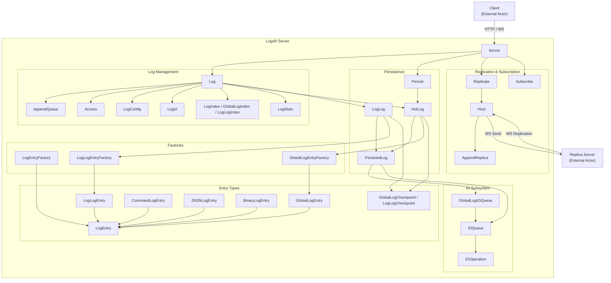
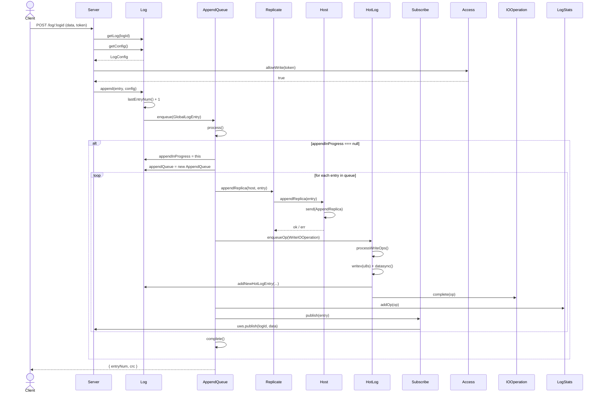

# LogsR — Technical Specification

## Version 0.1.0

---

## 1. Overview

LogsR is a distributed append‑only log server built on **uWebSockets.js**.  
It provides:

- **Create, append, read** operations on named logs identified by random 128‑bit IDs.
- **Token / JWT access control** with admin, read, and write permissions.
- **Synchronous replication** to configured replicas before acknowledgement.
- **Dual hot‑log rotation** with embedded checkpoints for crash‑consistent recovery.
- **Per‑log cold storage** (LogLog) that archives entries flushed from the hot logs.
- **WebSocket pub/sub** for real‑time streaming of new entries.
- **Pluggable entry types**: JSON, Binary, and internal Commands (CreateLog, SetConfig).

### Data Flow Summary

1. Client appends data → Server checks authorisation → Log creates `GlobalLogEntry` → enqueues in `AppendQueue`.
2. AppendQueue replicates to replicas → persists to `newHotLog` → publishes to subscribers.
3. Persist monitor periodically rotates hot logs: empties old hot log entries into per‑log LogLog files, then swaps new→old and starts a fresh new hot log.

---

## 2. Component Specifications

All classes are presented as self‑contained TypeScript **interface specifications** (signatures only, no implementation).  
The design is intended to be trivially portable to C (opaque struct pointers) and Rust (`struct` with `pub` methods).

### 2.1 Enumerations & Constants

```typescript
export enum EntryType {
    GLOBAL_LOG,
    LOG_LOG,
    GLOBAL_LOG_CHECKPOINT,
    LOG_LOG_CHECKPOINT,
    COMMAND,
    BINARY,
    JSON,
}

export enum CommandName {
    CREATE_LOG,
    SET_CONFIG,
}

export enum IOOperationType {
    READ_ENTRY,
    READ_ENTRIES,
    READ_RANGE,
    WRITE,
}

export type ReadIOOperation = ReadEntryIOOperation | ReadEntriesIOOperation | ReadRangeIOOperation

export const MAX_ENTRY_SIZE = 32768 // 32 KB
export const MAX_LOG_SIZE = 16777216 // 16 MB
export const MAX_RESPONSE_ENTRIES = 100

export const GLOBAL_LOG_CHECKPOINT_INTERVAL = 131072 // 128 KB
export const GLOBAL_LOG_CHECKPOINT_BYTE_LENGTH = 9
export const LOG_LOG_CHECKPOINT_INTERVAL = 131072
export const LOG_LOG_CHECKPOINT_BYTE_LENGTH = 13
export const GLOBAL_LOG_PREFIX_BYTE_LENGTH = 27
export const LOG_LOG_PREFIX_BYTE_LENGTH = 11
```

### 2.2 Entry Types

```typescript
/**
 * Abstract base for all log entries.
 */
export abstract class LogEntry {
    cksumNum: number = 0

    /** @returns the raw payload as a single Uint8Array */
    abstract u8(): Uint8Array

    /** @returns an array of segments for scatter/gather writes */
    abstract u8s(): Uint8Array[]

    /** @returns total byte length of the serialised entry */
    abstract byteLength(): number

    /** Compute and return the CRC-32 checksum for this entry.
     *  @param entryNum - the entry sequence number (used as seed) */
    cksum(entryNum: number): number {
        return 0
    }

    /** For fixed‑size entries, the expected byte length; 0 for variable‑length */
    static expectedByteLength: number = 0

    /** Create a new LogEntry of the correct class from a complete buffer. */
    static fromU8(u8: Uint8Array): LogEntry {
        throw new Error("Not implemented")
    }

    /** Attempt to deserialise a possibly incomplete buffer.
     *  Returns the entry, the number of missing bytes, or an error. */
    static fromPartialU8(u8: Uint8Array): {
        entry?: LogEntry | null
        needBytes?: number
        err?: Error
    } {
        throw new Error("Not implemented")
    }
}
```

#### Binary / JSON / Command

```typescript
export class BinaryLogEntry extends LogEntry {
    constructor(u8: Uint8Array)
    byteLength(): number
    cksum(entryNum: number): number
    u8(): Uint8Array
    u8s(): Uint8Array[]
    static fromU8(u8: Uint8Array): BinaryLogEntry
}

export class JSONLogEntry extends LogEntry {
    constructor(args: { jsonStr?: string | null; jsonU8?: Uint8Array | null })
    byteLength(): number
    cksum(entryNum: number): number
    u8(): Uint8Array
    u8s(): Uint8Array[]
    str(): string
    static fromU8(u8: Uint8Array): JSONLogEntry
}

export class CommandLogEntry extends LogEntry {
    readonly commandNameU8: Uint8Array
    readonly commandValueU8: Uint8Array

    constructor(args: { commandNameU8: Uint8Array; commandValueU8: Uint8Array })
    byteLength(): number
    cksum(entryNum: number): number
    u8(): Uint8Array
    u8s(): Uint8Array[]
    value(): any
}

export class JSONCommandType extends CommandLogEntry {
    constructor(args: { commandNameU8?: Uint8Array; commandValueU8?: Uint8Array; value?: any })
    value(): any
    setValue(value: any): void
}

export class U32CommandType extends CommandLogEntry {
    constructor(args: { commandNameU8?: Uint8Array; commandValueU8?: Uint8Array; value?: number })
    value(): number
    setValue(value: number): void
    static expectedByteLength: number = 6
}

export class StringCommandType extends CommandLogEntry {
    constructor(args: { commandNameU8?: Uint8Array; value?: string; commandValueU8?: Uint8Array })
    value(): string
    setValue(value: string): void
}

export class CreateLogCommand extends JSONCommandType {
    constructor(args: { commandValueU8?: Uint8Array; value?: any })
}

export class SetConfigCommand extends JSONCommandType {
    constructor(args: { commandValueU8?: Uint8Array; value?: any })
}
```

#### Wrappers & Checkpoints

```typescript
export class GlobalLogEntry extends LogEntry {
    readonly entryNum: number
    readonly logId: LogId
    readonly entry: LogEntry
    readonly crc: number | null

    constructor(args: { entryNum: number; logId: LogId; entry: LogEntry; crc?: number })
    key(): string // `${logId.base64()}-${entryNum}`
    byteLength(): number
    cksum(): number
    prefixU8(): Uint8Array // 27‑byte header
    u8(): Uint8Array
    u8s(): Uint8Array[]
    verify(): boolean
}

export class LogLogEntry extends LogEntry {
    readonly entry: LogEntry
    readonly entryNum: number
    readonly crc: number | null

    constructor(args: { entry: LogEntry; entryNum: number; crc?: number })
    byteLength(): number
    cksum(): number
    prefixU8(): Uint8Array // 11‑byte header
    u8(): Uint8Array
    u8s(): Uint8Array[]
    verify(): boolean
}

export class GlobalLogCheckpoint extends LogEntry {
    readonly lastEntryOffset: number
    readonly lastEntryLength: number
    readonly crc: number | null

    constructor(args: { lastEntryOffset: number; lastEntryLength: number; crc?: number })
    byteLength(): number // always 9
    cksum(): number
    verify(): boolean
    u8(): Uint8Array
    u8s(): Uint8Array[]
    static fromU8(u8: Uint8Array): GlobalLogCheckpoint
}

export class LogLogCheckpoint extends LogEntry {
    readonly lastEntryOffset: number
    readonly lastEntryLength: number
    readonly lastConfigOffset: number
    readonly crc: number | null

    constructor(args: { lastEntryOffset: number; lastEntryLength: number; lastConfigOffset: number; crc?: number })
    byteLength(): number // always 13
    cksum(entryNum?: number): number
    verify(): boolean
    u8(): Uint8Array
    u8s(): Uint8Array[]
    static fromU8(u8: Uint8Array): LogLogCheckpoint
}
```

### 2.3 Factories

```typescript
export class LogEntryFactory {
    static fromU8(u8: Uint8Array): LogEntry
    static fromPartialU8(u8: Uint8Array): {
        entry?: LogEntry | null
        needBytes?: number
        err?: Error
    }
}

export class GlobalLogEntryFactory {
    static fromU8(u8: Uint8Array): GlobalLogEntry
    static fromPartialU8(u8: Uint8Array): {
        entry?: LogLogEntry | GlobalLogEntry | null
        needBytes?: number
        err?: Error
    }
}

export class LogLogEntryFactory {
    static fromU8(u8: Uint8Array): LogLogEntry
    static fromPartialU8(u8: Uint8Array): {
        entry?: LogLogEntry | null
        needBytes?: number
        err?: Error
    }
}

export class CommandLogEntryFactory {
    static fromU8(u8: Uint8Array): CommandLogEntry
}
```

### 2.4 Log Identity & Addressing

```typescript
export class LogId {
    readonly logId: Uint8Array

    constructor(logId: Uint8Array, base64?: string)
    base64(): string
    byteLength(): number
    u8s(): Uint8Array[]
    toJSON(): string
    logDirPrefix(): string // "XX/YY" from first two bytes

    static newRandom(): Promise<LogId>
    static newFromBase64(base64: string): LogId
}

export class LogHost {
    master: string
    replicas: string[]

    constructor(master: string, replicas?: string[])
    static fromString(host: string): LogHost
    toString(): string
}

export class LogAddress {
    logIdBase64: string
    host: LogHost | null
    config: LogHost[] | null

    constructor(logIdBase64: string, host?: LogHost | null, config?: LogHost[] | null)
    setConfig(config: LogHost[]): void
    setHost(host: LogHost): void
    toString(): string
    static fromString(logAddress: string): LogAddress
}
```

### 2.5 Configuration

```typescript
export interface ILogConfig {
    logId: string
    type: string // "binary" | "json"
    master: string
    replicas?: string[]
    asyncReplicas?: string[]
    access: string // "public" | "private" | "readOnly" | "writeOnly"
    authType: string // "token" | "jwt"
    accessToken?: string
    adminToken?: string
    readToken?: string
    writeToken?: string
    superToken?: string
    jwtProperties?: string[]
    jwtSecret?: string
    stopped: boolean
    configLogAddress?: string | LogAddress
}

export class LogConfig implements ILogConfig {
    // all ILogConfig fields
    logId!: string
    type!: string
    master!: string
    replicas?: string[]
    asyncReplicas?: string[]
    access!: string
    authType!: string
    accessToken?: string
    adminToken?: string
    readToken?: string
    writeToken?: string
    superToken?: string
    jwtProperties?: string[]
    jwtSecret?: string
    stopped!: boolean
    configLogAddress?: string | LogAddress

    constructor(config: ILogConfig)
    replicationGroup(): string[] // [master, ...replicas]
    setDefaults(): Promise<void> // generate missing tokens/secrets
    static newFromJSON(json: any): Promise<LogConfig>
}
```

### 2.6 Log Index & Statistics

```typescript
export class LogIndex {
    en: number[] = [] // [entryNum, offset, length, ...]
    lcNum: number | null = null
    lcOff: number | null = null
    lcLen: number | null = null

    addEntry(entry: LogEntry, entryNum: number, offset: number, length: number): void
    hasEntry(entryNum: number): boolean
    entry(entryNum: number): [number, number, number]
    entries(): number[]
    entryCount(): number
    appendIndex(index: LogIndex): void
    byteLength(prefixByteLength: number): number
    hasConfig(): boolean
    lastConfig(): [number, number, number]
    lastConfigEntryNum(): number
    hasEntries(): boolean
    lastEntry(): [number, number, number]
    maxEntryNum(): number
}

export class GlobalLogIndex extends LogIndex {
    byteLength(): number // uses GLOBAL_LOG_PREFIX_BYTE_LENGTH
}

export class LogLogIndex extends LogIndex {
    byteLength(): number // uses LOG_LOG_PREFIX_BYTE_LENGTH
}

export class LogStats {
    ioReads: number = 0
    bytesRead: number = 0
    ioReadTimeAvg: number = 0
    ioReadTimeMax: number = 0
    ioReadLastTime: number = 0
    ioWrites: number = 0
    bytesWritten: number = 0
    ioWriteTimeAvg: number = 0
    ioWriteTimeMax: number = 0
    ioWriteLastTime: number = 0

    addOp(op: IOOperation): void
}
```

### 2.7 Access Control

```typescript
export type AccessAllowed = {
    admin: boolean
    read: boolean
    write: boolean
}

export class Access {
    readonly log: Log

    constructor(log: Log)
    accessAllowed(admin: boolean, read: boolean, write: boolean): AccessAllowed
    allowed(token: string | null): Promise<AccessAllowed>
    allowAdmin(token: string | null): Promise<boolean>
    allowRead(token: string | null): Promise<boolean>
    allowWrite(token: string | null): Promise<boolean>
    jwtSecretU8(): Uint8Array
}
```

### 2.8 Log Orchestrator

```typescript
export class Log {
    readonly server: Server
    readonly logId: LogId
    readonly access: Access
    readonly stats: LogStats

    newHotLogIndex: GlobalLogIndex | null
    oldHotLogIndex: GlobalLogIndex | null
    logLogIndex: LogLogIndex | null
    logLog: LogLog | null
    creating: boolean
    config: LogConfig | null
    appendInProgress: AppendQueue | null
    appendQueue: AppendQueue
    stopped: boolean

    constructor(server: Server, logId: LogId)

    getLogLog(): Promise<LogLog>
    stop(): Promise<void>

    append(entry: LogEntry, config?: LogConfig | null): Promise<GlobalLogEntry>
    appendOp(target: PersistedLog, entry: GlobalLogEntry | LogLogEntry): Promise<WriteIOOperation>
    readEntryOp(target: PersistedLog, index: LogIndex, entryNum: number): Promise<ReadEntryIOOperation>
    readEntriesOp(target: PersistedLog, index: LogIndex, entryNums: number[]): Promise<ReadEntriesIOOperation>

    moveNewToOldHotLog(): void
    emptyOldHotLog(): Promise<void>

    create(config: LogConfig): Promise<GlobalLogEntry>
    exists(): Promise<boolean>

    getConfig(): Promise<LogConfig>
    setConfig(setConfig: any, lastConfigNum: number, unsafe?: boolean): Promise<GlobalLogEntry>
    getConfigEntry(): Promise<GlobalLogEntry | LogLogEntry>
    hasGlobalConfig(): boolean
    readConfigTargetIndexEntryNum(): [PersistedLog, LogIndex, number]
    lastLogConfigOffset(): number

    getHead(): Promise<GlobalLogEntry | LogLogEntry>
    readHeadTargetIndexEntryNum(): [PersistedLog, LogIndex, number]

    getEntryNums(entryNums: number[]): Promise<Array<GlobalLogEntry | LogLogEntry>>
    getEntries(offset: number, limit: number): Promise<Array<GlobalLogEntry | LogLogEntry>>
    lastEntryNum(): number

    addNewHotLogEntry(entry: LogEntry, entryNum: number, entryOffset: number, length: number): void
    addOldHotLogEntry(entry: LogEntry, entryNum: number, entryOffset: number, length: number): void
    addLogLogEntry(entry: LogEntry, entryNum: number, entryOffset: number, length: number): void

    newHotLogEntryCount(): number
    oldHotLogEntryCount(): number
    logLogEntryCount(): number
    filename(): string
}

export class AppendQueue {
    readonly log: Log
    entries: AppendQueueEntry[] = []
    promise: Promise<void>
    resolve: (() => void) | null = null
    reject: ((err: any) => void) | null = null
    lastConfig: GlobalLogEntry | null = null

    constructor(log: Log)
    enqueue(entry: GlobalLogEntry, config?: LogConfig | null): void
    process(): Promise<void>
    hasConfig(): boolean
    hasEntries(): boolean
    waitHead(): Promise<GlobalLogEntry>
    waitConfig(): Promise<GlobalLogEntry>
    complete(retried?: boolean): void
    completeWithError(err: any, retried?: boolean): void
}

type AppendQueueEntry = {
    entry: GlobalLogEntry
    op: WriteIOOperation
    config: LogConfig | null
}
```

### 2.9 IO Operations & Queues

```typescript
export class IOOperation {
    readonly op: IOOperationType
    readonly logId: LogId | null
    readonly promise: Promise<any>
    readonly startTime: number
    readonly order: number
    endTime: number = 0
    processing: boolean = false

    constructor(op: IOOperationType, logId?: LogId | null, promise?: Promise<any>, resolve?: any, reject?: any)
    complete(op: IOOperation, retried?: boolean): void
    completeWithError(error: any, retried?: boolean): void
}

export class ReadEntryIOOperation extends IOOperation {
    index: LogIndex
    entryNum: number
    entry: GlobalLogEntry | LogLogEntry | null = null
    bytesRead: number = 0

    constructor(logId: LogId, index: LogIndex, entryNum: number)
}

export class ReadEntriesIOOperation extends IOOperation {
    index: LogIndex
    entryNums: number[]
    entries: Array<GlobalLogEntry | LogLogEntry> | null = null
    bytesRead: number = 0

    constructor(logId: LogId, index: LogIndex, entryNums: number[])
}

export class ReadRangeIOOperation extends IOOperation {
    reads: number[] | null
    buffers: Uint8Array[] = []
    bytesRead: number = 0

    constructor(reads?: number[] | null, logId?: LogId | null)
}

export class WriteIOOperation extends IOOperation {
    entry: GlobalLogEntry | LogLogEntry
    entryNum: number | null = null
    bytesWritten: number = 0

    constructor(entry: GlobalLogEntry | LogLogEntry, logId?: LogId | null, entryNum?: number | null)
}

export class IOQueue {
    readQueue: ReadIOOperation[] = []
    writeQueue: WriteIOOperation[] = []

    getReady(): [ReadIOOperation[], WriteIOOperation[]]
    drain(): [ReadIOOperation[], WriteIOOperation[]]
    opPending(): boolean
    enqueue(op: IOOperation): void
}

export class GlobalLogIOQueue {
    queues: Map<string, IOQueue> = new Map()

    enqueue(item: IOOperation): void
    deleteLogQueue(logId: LogId): IOQueue | null
    getLogQueue(logId: LogId): IOQueue
    getGlobalQueue(): IOQueue
    getReady(): [ReadIOOperation[], WriteIOOperation[]]
    opPending(): boolean
}
```

### 2.10 Persistence

```typescript
export abstract class PersistedLog {
  logFile: string = '';
  server: Server;
  ioQueue: GlobalLogIOQueue | IOQueue = new IOQueue();
  writeFH: FileHandle | null = null;
  freeReadFhs: Array<FileHandle> = [];
  openReadFhs: Array<FileHandle> = [];
  openingReadFhs: number = 0;
  maxReadFHs: number = 1;
  byteLength: number = 0;
  ioBlocked: boolean = false;
  ioInProgress: Promise<void> | null = null;
  constructor(server: Server);

  blockIO(): Promise<void>;
  unblockIO(): void;
  waitInProgress(): Promise<void>;
  closeAllFHs(): Promise<void>;
  getReadFH(): FileHandle | null;
  closeReadFH(fh: FileHandle): void;
  doneReadFH(fh: FileHandle): void;
  getWriteFH(): Promise<FileHandle>;
  closeWriteFH(): Promise<void>;

  enqueueOp(op: IOOperation): void;
  enqueueOps(ops: IOOperation[]): void;
  processOps(): void;
  processOpsAsync(): Promise<void>;
  processReadOps(ops: ReadIOOperation[]): Promise<void>;
  processWriteOps(ops: WriteIOOperation[]): Promise<void>;
  truncate(byteLength: number): Promise<void>;

  init(
    logEntryFactory: typeof GlobalLogEntryFactory | typeof LogLogEntryFactory,
    checkpointClass: typeof GlobalLogCheckpoint | typeof LogLogCheckpoint,
    checkpointInterval: number
  ): Promise<void>;

  initLogLogEntry(entry: LogLogEntry, entryOffset: number): void;
  initGlobalLogEntry(entry: GlobalLogEntry, entryOffset: number): void;

  protected abstract _processReadLogEntry(
    fh: FileHandle, logId: LogId, entryNum: number, offset: number, length: number
  ): Promise<[GlobalLogEntry | LogLogEntry, number]>;
}

export class HotLog extends PersistedLog {
  readonly ioQueue: GlobalLogIOQueue;
  readonly isNew: boolean;
  maxReadFHs: number = 16;

  constructor(server: Server, isNew: boolean);
  logName(): string;
  processWriteOps(ops: WriteIOOperation[]): Promise<void>;
  init(): Promise<void>;
  initGlobalLogEntry(entry: GlobalLogEntry, entryOffset: number): void;
  addEntryToIndex(entry: GlobalLogEntry, entryOffset: number): void;
  _processReadLogEntry(...): Promise<[GlobalLogEntry, number]>;
}

export class LogLog extends PersistedLog {
  readonly log: Log;
  maxReadFHs: number = 4;

  constructor(server: Server, log: Log);
  logName(): string;
  processWriteOps(ops: WriteIOOperation[]): Promise<void>;
  init(): Promise<void>;
  initLogLogEntry(entry: LogLogEntry, entryOffset: number): void;
  _processReadLogEntry(...): Promise<[LogLogEntry, number]>;
}

export class Persist {
  readonly server: Server;
  oldHotLog: HotLog;
  newHotLog: HotLog;
  emptyOldHotLogInProgress: Promise<void> | null = null;
  moveNewToOldHotLogInProgress: Promise<void> | null = null;

  constructor(server: Server);
  init(): Promise<void>;
  monitor(): void;
  globalIndexEntryCounts(): { newHotLog: number; oldHotLog: number };
  emptyOldHotLog(): Promise<void>;
  moveNewToOldHotLog(): Promise<void>;
}

```

### 2.11 Networking

```typescript
export interface ServerConfig {
    host: string
    dataDir: string
    pageSize: number
    globalIndexCountLimit: number
    globalIndexSizeLimit: number
    hotLogFileName?: string
    blobDir?: string
    logDir?: string
    hosts: string[]
    hostMonitorInterval: number
    replicatePath: string
    replicateTimeout: number
    secret: string
}

export class Server {
    readonly config: ServerConfig
    readonly persist: Persist
    readonly replicate: Replicate
    readonly subscribe: Subscribe
    readonly uws: TemplatedApp
    readonly logs: Map<string, Log>

    constructor(config: ServerConfig, uws: TemplatedApp)
    delLog(logId: LogId): void
    getLog(logId: LogId): Log
    init(): Promise<void>

    createLog(config: any): Promise<GlobalLogEntry>
    appendLog(
        logId: LogId,
        token: string | null,
        data: Uint8Array,
        lastEntryNum: number | null,
    ): Promise<GlobalLogEntry>
    appendReplica(entry: GlobalLogEntry): Promise<GlobalLogEntry>

    getConfig(
        logId: LogId,
        token: string | null,
    ): Promise<{ allowed: AccessAllowed; entry: GlobalLogEntry | LogLogEntry }>
    setConfig(
        logId: LogId,
        token: string | null,
        setConfig: any,
        lastConfigNum: number,
    ): Promise<GlobalLogEntry | LogLogEntry>

    getEntries(
        logId: LogId,
        token: string | null,
        entryNums?: string | number[],
        offset?: string | number,
        limit?: string | number,
    ): Promise<{ allowed: AccessAllowed; entries: Array<GlobalLogEntry | LogLogEntry> }>
    getHead(
        logId: LogId,
        token: string | null,
    ): Promise<{ allowed: AccessAllowed; entry: GlobalLogEntry | LogLogEntry }>
    deleteLog(logId: LogId): Promise<boolean>
}

export class Replicate {
    readonly server: Server
    readonly hosts: Map<string, Host>

    constructor(server: Server)
    appendReplica(host: string, entry: GlobalLogEntry): Promise<void>
}

export class Host {
    readonly host: string
    readonly replicate: Replicate
    ws: WebSocket | null = null
    lastError: Error | null = null
    connectStart: number | null = null
    connectFinish: number | null = null
    lastPing: number | null = null
    lastPong: number | null = null

    constructor(replicate: Replicate, host: string)
    appendReplica(entry: GlobalLogEntry): Promise<void>
    connect(): void
    monitor(): void
    send(appendReplica: AppendReplica): void
    sendAll(): void
}

export class AppendReplica {
    readonly host: Host
    readonly entry: GlobalLogEntry
    readonly promise: Promise<void>
    readonly start: number
    sent: boolean = false

    constructor(host: Host, entry: GlobalLogEntry)
    timeout(): void
    complete(retried?: boolean): void
    completeWithError(err: any, retried?: boolean): void
}

export class Subscribe {
    readonly server: Server
    readonly subscriptions: Map<string, boolean>

    constructor(server: Server)
    allowSubscription(logId: LogId, token?: string | null): Promise<boolean>
    addSubscription(logId: string): void
    delSubscription(logId: string): void
    hasSubscription(logId: string): boolean
    publish(entry: GlobalLogEntry): void
}
```

---

## 3. System Architecture

The following C4 **container** diagram shows the static structure. Every node corresponds to one of the classes defined in §2.



---

## 4. Detailed Data Flow

The sequence diagram below models the **append** operation, referencing methods from §2.



---

## 5. Testing Requirements

### 5.1 Unit Tests

| Class                | Method                                                             | Test Case                                                         | Verification                                                    |
| -------------------- | ------------------------------------------------------------------ | ----------------------------------------------------------------- | --------------------------------------------------------------- |
| `LogId`              | `newRandom()`                                                      | Generates 16 random bytes                                         | `byteLength() === 16`                                           |
| `LogId`              | `base64()`                                                         | Encode & decode round‑trip                                        | `newFromBase64(base64()).base64() === base64()`                 |
| `LogId`              | `logDirPrefix()`                                                   | Derive directory prefix                                           | Format `XX/YY` from first two bytes                             |
| `LogHost`            | `fromString` / `toString`                                          | `"master,replica1,replica2"`                                      | Correct master and replica array                                |
| `LogAddress`         | `fromString`                                                       | Full address with config hosts                                    | Sections correctly parsed                                       |
| `LogConfig`          | `newFromJSON`                                                      | Minimal valid config, token auth                                  | Defaults filled correctly; no duplicate token generation        |
| `LogConfig`          | `newFromJSON`                                                      | JWT auth – no tokens                                              | Secret generated, no token conflict                             |
| `LogConfig`          | `newFromJSON`                                                      | Invalid access/token combos                                       | Throws `InvalidLogConfigError`                                  |
| `LogIndex`           | `addEntry`                                                         | Sequential entries                                                | `entryCount()` correct; entry lookup returns correct triple     |
| `LogIndex`           | `appendIndex`                                                      | Merge two indexes                                                 | Combined order, latest config wins                              |
| `GlobalLogIndex`     | `byteLength()`                                                     | Uses `GLOBAL_LOG_PREFIX_BYTE_LENGTH`                              | Sum matches expected                                            |
| `LogLogIndex`        | `byteLength()`                                                     | Uses `LOG_LOG_PREFIX_BYTE_LENGTH`                                 | Sum matches expected                                            |
| `LogStats`           | `addOp`                                                            | Read & write operations                                           | Counts and averages update correctly                            |
| `Access`             | `allowed`                                                          | Various token / JWT scenarios (public, scoped, super, JWT claims) | Permissions match the rules documented in `allowed()`           |
| `AppendQueue`        | `enqueue` + `waitHead`                                             | Single entry                                                      | Resolves with correct `GlobalLogEntry`                          |
| `AppendQueue`        | `enqueue` + `waitConfig`                                           | Entry with config                                                 | Resolves with the config‑carrying entry                         |
| `Log`                | `create`                                                           | New log                                                           | Creates `CreateLogCommand`, sets config                         |
| `Log`                | `append`                                                           | Concurrent `lastEntryNum` tracking                                | Entry numbers increase monotonically                            |
| `Log`                | `setConfig`                                                        | Concurrent protection & config number check                       | Rejects if config update already in progress or number mismatch |
| `Log`                | `getHead`                                                          | Pending appends vs stored index                                   | Returns correct latest entry                                    |
| `Log`                | `getEntries` / `getEntryNums`                                      | Entries split across hot/cold logs                                | Correct assembly in requested order                             |
| `HotLog`             | `processWriteOps`                                                  | Entry crossing checkpoint boundary                                | Checkpoint inserted; entry reconstructed correctly              |
| `LogLog`             | `processWriteOps`                                                  | Same as HotLog, plus `lastConfigOffset`                           | Checkpoint contains correct config offset                       |
| `PersistedLog`       | `init`                                                             | Rebuild indexes from checkpoints                                  | All entries recovered; `byteLength` set                         |
| `Persist`            | `monitor`                                                          | Triggers `emptyOldHotLog` or `moveNewToOldHotLog`                 | Invoked when conditions met                                     |
| `Server`             | `createLog` / `appendLog` / `getEntries` / `setConfig` / `getHead` | Standard API calls                                                | Correct HTTP‑like behaviour, error codes                        |
| `Replicate` / `Host` | `appendReplica`                                                    | Successful send & ack                                             | Promise resolves; timeout triggers error                        |
| `Subscribe`          | `publish`                                                          | WebSocket push                                                    | Message format `{entryNum, entry}`                              |
| All IO operations    | `complete` / `completeWithError`                                   | Promise resolution / rejection                                    | Timestamps set, callbacks invoked                               |

### 5.2 End‑to‑End Tests

**Environment Setup**

- Three LogsR instances on different ports, each with isolated data directories.
- Shared secret for inter‑server replication.
- Test client using `node-fetch` and `ws`.

| ID     | Test                      | Steps                                                                                                 | Expected Outcome                                                                              |
| ------ | ------------------------- | ----------------------------------------------------------------------------------------------------- | --------------------------------------------------------------------------------------------- |
| E2E‑1  | Basic create & append     | Create log → append JSON → get head → get entries                                                     | All requests succeed; data matches                                                            |
| E2E‑2  | Access control – token    | Create private log with scoped tokens; attempt operations with invalid/valid tokens                   | 403 for unauthorised; correct scoping                                                         |
| E2E‑3  | Access control – JWT      | Create JWT log; use HS256 tokens with various `allow` claims                                          | Permissions enforced                                                                          |
| E2E‑4  | Optimistic concurrency    | Append with `lastEntryNum`; repeat with stale number                                                  | Second returns 409                                                                            |
| E2E‑5  | Stop log                  | Set `stopped:true`; try append                                                                        | Append returns error, reads still work                                                        |
| E2E‑6  | Replication               | Create log on master with replicas; append; verify entry exists on replica (via admin or direct read) | All replicas receive the entry                                                                |
| E2E‑7  | Crash recovery            | Append 20 entries, kill server, restart                                                               | All entries readable; new append picks up correct `entryNum`                                  |
| E2E‑8  | Concurrent stress         | N clients each appending M deterministic entries with retries                                         | Total entries = N×M, no duplicates, no gaps                                                   |
| E2E‑9  | Mixed read/write load     | Sustained mix of appends and reads on two logs                                                        | No errors; data consistency                                                                   |
| E2E‑10 | Hot log rotation          | Lower `globalIndexCountLimit`, force rotation via admin route, append more, read back                 | All entries preserved across rotations                                                        |
| E2E‑11 | WebSocket subscription    | Subscribe to log via WS, append REST, check WS message                                                | Subscriber receives `{entryNum, entry}`                                                       |
| E2E‑12 | Replica failure tolerance | Stop a replica, append on master, restart replica, append again                                       | Desired: log remains operational; current behaviour depends on error handling (to be refined) |

**Post‑test validation**

- Checkpoint files are valid and all CRCs match.
- No open file handles left behind.
- LogLog files contain only flushed entries, no duplicates.

---

## 6. CLI Entry Point

The server is started by running the built `index.js` (or `server.js`) with environment variable configuration.

```bash
DATA_DIR=./data \
HOST=127.0.0.1 \
HOSTS="127.0.0.1:7000 127.0.0.1:7001 127.0.0.1:7002" \
PORT=7000 \
REPLICATE_TIMEOUT=3000 \
SERVER_SECRET=my-shared-secret \
HOST_MONITOR_INTERVAL=10000 \
node dist/server.js
```

**Environment variables** (all have defaults):

| Variable                | Default     | Description                                                          |
| ----------------------- | ----------- | -------------------------------------------------------------------- |
| `DATA_DIR`              | `./data`    | Base data directory                                                  |
| `HOST`                  | `127.0.0.1` | This server’s hostname (will be combined with `PORT` as `host:port`) |
| `HOSTS`                 | `""`        | Space‑separated list of all cluster hosts (`host:port`)              |
| `PORT`                  | `7000`      | Listening port                                                       |
| `REPLICATE_PATH`        | `replicate` | WebSocket path for replication                                       |
| `REPLICATE_TIMEOUT`     | `3000`      | Replication handshake timeout (ms)                                   |
| `SERVER_SECRET`         | `secret`    | Shared secret for inter‑server auth                                  |
| `HOST_MONITOR_INTERVAL` | `10000`     | Health‑check interval (ms)                                           |

The server creates a `uWS.App()` and registers all REST and WebSocket routes before calling `listen()`.

---

## 7. Known Issues

The following issues have been identified during a compliance review of the implementation against this specification.

### 7.1 LogIndex.entry() Sequential Assumption

The `LogIndex.entry()` method uses a direct indexing formula `(entryNum - en[0]) * 3` to locate entries in the flat `en` array. In contrast, `hasEntry()` uses a linear scan. If gaps exist in the entry number sequence (e.g., after partial crash recovery or a replayed entry range), `entry()` would silently return incorrect triples. The method should either use a linear scan (like `hasEntry()`) or validate that entries are contiguous before applying the formula.

### 7.2 Import Mismatch in LogStats (`ReadIOOperation`)

`src/lib/log/log-stats.ts` imports `ReadIOOperation` from `"../persist/io/read-range-io-operation"`, but that file exports `ReadRangeIOOperation`. The canonical `ReadIOOperation` union type is defined in `globals.ts`. This is a TypeScript module‑resolution issue; the cast `(op as ReadIOOperation).bytesRead` works at runtime only because the imported symbol resolves to the `ReadRangeIOOperation` class, which happens to have a `bytesRead` property. This should be corrected to import from `"../globals"`.

### 7.3 Inconsistent Checkpoint CRC Computation

`GlobalLogCheckpoint.cksum()` seeds the CRC-32 computation with the entry type byte via `crc32(this.u8(), crc32(TYPE_BYTE))`, while `LogLogCheckpoint.cksum()` computes `crc32(this.u8())` without any seed. All other entry types (`BinaryLogEntry`, `JSONLogEntry`, `CommandLogEntry`) consistently use the pattern `crc32(data, crc32(TYPE, entryNum))`. The `LogLogCheckpoint` CRC routine should be aligned to use a consistent seeding strategy.

### 7.4 ReadRangeIOOperation ("not implemented")

The `_processReadRangeOp` method in `PersistedLog` throws `new Error("not implemented")`. This operation type is declared in `IOOperationType` and has an associated `ReadRangeIOOperation` class, but no actual implementation exists.

### 7.5 Missing Class Specifications

The following classes exist in the implementation but are not documented in this specification:

- **`U32CommandType`** (`src/lib/entry/command/command-type/u32-command-type.ts`): Command type for 32‑bit unsigned integer values. Extends `CommandLogEntry`.
- **`StringCommandType`** (`src/lib/entry/command/command-type/string-command-type.ts`): Command type for string values. Extends `CommandLogEntry`.

These have been added to §2.2 in this revision.

### 7.6 Host.lastPing / lastPong (Unused Fields)

The `Host` class declares `lastPing` and `lastPong` properties in the specification, but the implementation does not use them for any health‑check or timeout logic.

### 7.7 Checkpoint Boundary Edge Case

Both `HotLog._processReadLogEntry()` and `LogLog._processReadLogEntry()` check for the case where an entry starts exactly at a checkpoint boundary (`offset === nextCheckpointOffset`) and throw an error. This condition should never occur under normal operation, but if it does, it causes a crash rather than attempting recovery.

