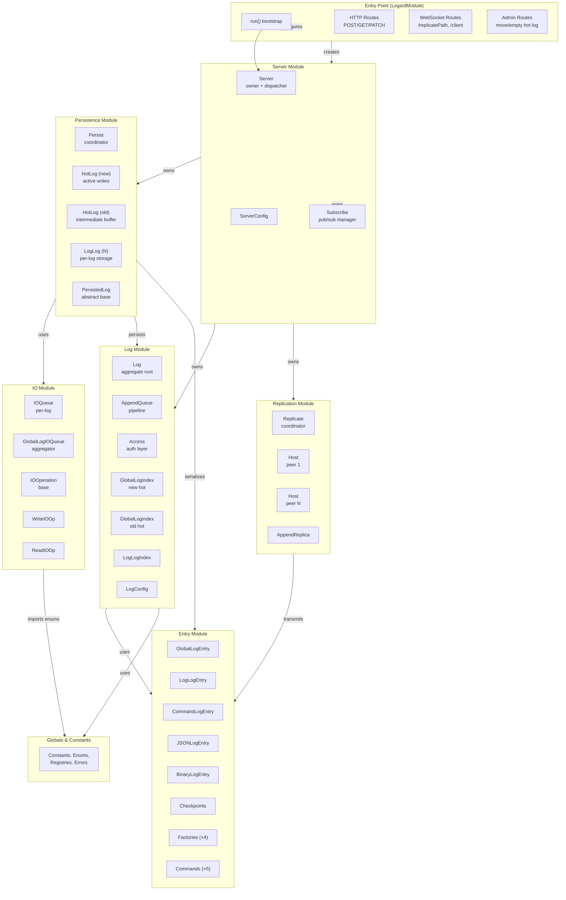
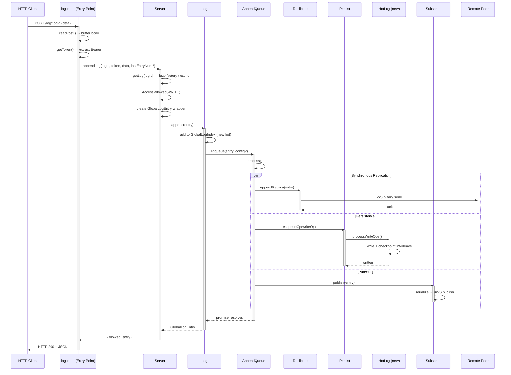

# logsrd — Technical Specification

> **Project:** logsrd — A Synchronously Replicated Distributed Log Server
> **Language:** TypeScript (ES2022)
> **Runtime:** Node.js + uWebSockets.js
> **Testing:** Jest 30 + ts-jest
> **Spec tree:** 83 file-level specs across 8 sub-modules

---

## §1 Overview

logsrd is a **synchronously-replicated distributed append-only log server**. Clients write entries via an HTTP REST API; every append is synchronously replicated to all configured peer nodes before the HTTP response is returned. The system provides:

- **REST API** — create, append, read, configure logs over HTTP
- **WebSocket replication** — binary protocol for server-to-server synchronous replication
- **Pub/Sub subscriptions** — WebSocket endpoint for real-time log entry delivery to clients
- **Two-tier persistence** — global hot log (new + old) with periodic compaction into per-log log-of-logs

### Module Reference Table

| Module | Facade | Spec Path |
|---|---|---|
| Entry Types | EntryModule | `source/src/lib/entry/EntryModule.spec.md` |
| Log Abstraction | LogModule | `source/src/lib/log/LogModule.spec.md` |
| Persistence | PersistModule | `source/src/lib/persist/PersistModule.spec.md` |
| IO Operations | IOModule | `source/src/lib/persist/io/IOModule.spec.md` |
| Replication | ReplicateModule | `source/src/lib/replicate/ReplicateModule.spec.md` |
| Server | ServerModule | `source/src/lib/server/ServerModule.spec.md` |
| Globals & Constants | GlobalsModule | `source/src/lib/globals/GlobalsModule.spec.md` |
| Entry Point | LogsrdModule | `source/src/logsrd/LogsrdModule.spec.md` |

### Source File-Level Specs

| # | Module | Spec File | Role |
|---|---|---|---|
| 1 | EntryPoint | `Logsrd.spec.md` | Bootstrap and HTTP/WS route configuration: env parsing, uWS app, route registration |
| 2 | Server | `Server.spec.md` | Central orchestrator: owns Persist/Replicate/Subscribe, Log registry, public API |
| 3 | Subscribe | `Subscribe.spec.md` | WebSocket pub/sub manager for real-time log entry delivery |
| 4 | Log | `Log.spec.md` | Central log aggregate with three-tier storage hierarchy (NewHot → OldHot → LogLog) |
| 5 | LogConfig | `LogConfig.spec.md` | Per-log configuration with JSON Schema (AJV) validation |
| 6 | LogId | `LogId.spec.md` | 16-byte unique log identifier with Base64URL encoding and hex directory prefix |
| 7 | LogAddress | `LogAddress.spec.md` | Address string encoding logId + host + config hosts |
| 8 | LogHost | `LogHost.spec.md` | Replication group: master + replicas as comma-separated string |
| 9 | LogIndex | `LogIndex.spec.md` | In-memory entry triplet `[entryNum, offset, length]` index with config tracking |
| 10 | GlobalLogIndex | `GlobalLogIndex.spec.md` | LogIndex with `GLOBAL_LOG_PREFIX_BYTE_LENGTH` override |
| 11 | LogLogIndex | `LogLogIndex.spec.md` | LogIndex with `LOG_LOG_PREFIX_BYTE_LENGTH` override |
| 12 | LogStats | `LogStats.spec.md` | Per-log I/O performance metrics (counts, bytes, timing) |
| 13 | Access | `Access.spec.md` | Token/JWT-based authorization for read/write/admin operations |
| 14 | AppendQueue | `AppendQueue.spec.md` | Serialised append pipeline: replicate → persist → publish |
| 15 | Persist | `Persist.spec.md` | Dual HotLog lifecycle coordinator with periodic compaction monitor |
| 16 | PersistedLog | `PersistedLog.spec.md` | Abstract base for on-disk persistence: file handles, IO queue, checkpoint init |
| 17 | HotLog | `HotLog.spec.md` | Global hot log: GlobalLogEntry read/write with checkpoint interleaving |
| 18 | LogLog | `LogLog.spec.md` | Per-log persistence file: LogLogEntry read/write tied to a single Log |
| 19 | IOOperation | `IOOperation.spec.md` | Base I/O operation: promise, timing, global ordering via monotonic counter |
| 20 | IOQueue | `IOQueue.spec.md` | Dual-queue structure separating read/write operations per log |
| 21 | GlobalLogIOQueue | `GlobalLogIOQueue.spec.md` | Per-log partitioned queue aggregator with global total ordering |
| 22 | WriteIOOperation | `WriteIOOperation.spec.md` | Write operation wrapping GlobalLogEntry/LogLogEntry |
| 23 | ReadEntryIOOperation | `ReadEntryIOOperation.spec.md` | Read-single operation resolving entry via LogIndex |
| 24 | ReadEntriesIOOperation | `ReadEntriesIOOperation.spec.md` | Batch read operation for multiple entry numbers |
| 25 | ReadRangeIOOperation | `ReadRangeIOOperation.spec.md` | Stub for range-based read operations (not yet implemented) |
| 26 | Replicate | `Replicate.spec.md` | Replication coordinator managing per-peer Host connections |
| 27 | Host | `Host.spec.md` | Per-peer WebSocket client with reconnect, ping/pong, timeout |
| 28 | AppendReplica | `AppendReplica.spec.md` | Single replication attempt: promise, timeout, sent-guard |
| 29 | LogEntry (abstract) | `LogEntry.spec.md` | Abstract base: serialization contract `u8()`/`u8s()`, byte length, CRC |
| 30 | LogEntryFactory | `LogEntryFactory.spec.md` | Top-level deserialisation dispatcher reading type byte |
| 31 | GlobalLogEntry | `GlobalLogEntry.spec.md` | 27-byte prefix envelope with LogId, entryNum, length, CRC32 |
| 32 | GlobalLogEntryFactory | `GlobalLogEntryFactory.spec.md` | Deserialises GlobalLogEntry from binary (full + partial) |
| 33 | LogLogEntry | `LogLogEntry.spec.md` | 11-byte prefix envelope for per-log journal entries |
| 34 | LogLogEntryFactory | `LogLogEntryFactory.spec.md` | Deserialises LogLogEntry from binary (full + partial) |
| 35 | GlobalLogCheckpoint | `GlobalLogCheckpoint.spec.md` | 9-byte checkpoint with negative offset/length for reverse-scan recovery |
| 36 | LogLogCheckpoint | `LogLogCheckpoint.spec.md` | 13-byte checkpoint with lastConfigOffset for logical-log recovery |
| 37 | CommandLogEntry | `CommandLogEntry.spec.md` | Typed command entry with 1-byte CommandName dispatch |
| 38 | CommandLogEntryFactory | `CommandLogEntryFactory.spec.md` | Deserialises command entries by command name byte |
| 39 | JSONLogEntry | `JSONLogEntry.spec.md` | Entry holding a JSON string payload |
| 40 | BinaryLogEntry | `BinaryLogEntry.spec.md` | Entry wrapping opaque Uint8Array binary data |
| 41 | CreateLogCommand | `CreateLogCommand.spec.md` | Create-log command (extends JSONCommandType, CommandName byte 0x00) |
| 42 | SetConfigCommand | `SetConfigCommand.spec.md` | Set-config command (extends JSONCommandType, CommandName byte 0x01) |
| 43 | JSONCommandType | `JSONCommandType.spec.md` | Base for JSON-valued command entries |
| 44 | U32CommandType | `U32CommandType.spec.md` | Base for u32-valued command entries |
| 45 | StringCommandType | `StringCommandType.spec.md` | Base for string-valued command entries |
| 46 | Globals | `Globals.spec.md` | Shared constants, enums, type registries, AbortWriteError |

### Test File-Level Specs

| # | Module | Test Spec | Validates |
|---|---|---|---|
| 1 | EntryPoint | `logsrd.test.ts` | Env parsing, Server construction, route registration, WS handlers |
| 2 | Server | `Server.test.spec.md` | Server CRUD API, append, read, auth, master checks |
| 3 | Subscribe | `Subscribe.test.spec.md` | Subscription lifecycle, publish serialization |
| 4 | Log | `Log.test.spec.md` | Append pipeline, getHead, getEntries, index ops, stop |
| 5 | LogConfig | `LogConfig.test.spec.md` | JSON Schema validation, defaults, replicationGroup |
| 6 | LogId | `LogId.test.spec.md` | Random generation, Base64URL, hex prefix, round-trip |
| 7 | LogAddress | `LogAddress.test.spec.md` | String format, bidirectional conversion |
| 8 | LogHost | `LogHost.test.spec.md` | Master/replica parsing, fromString |
| 9 | LogIndex | `LogIndex.test.spec.md` | Triplet storage, config tracking, merge, byteLength |
| 10 | GlobalLogIndex | `GlobalLogIndex.test.spec.md` | Prefix override, inherited behavior |
| 11 | LogLogIndex | `LogLogIndex.test.spec.md` | Prefix override, inherited behavior |
| 12 | LogStats | `LogStats.test.spec.md` | Read/write counts, timing stats |
| 13 | Access | `Access.test.spec.md` | Token and JWT auth modes, claim checking |
| 14 | AppendQueue | `AppendQueue.test.spec.md` | Enqueue, pipeline processing, waitHead |
| 15 | IOOperation | `IOOperation.test.spec.md` | Promise lifecycle, complete/error, ordering |
| 16 | IOQueue | `IOQueue.test.spec.md` | Read/write routing, drain, getReady |
| 17 | GlobalLogIOQueue | `GlobalLogIOQueue.test.spec.md` | Per-log routing, aggregator, global sort |
| 18 | WriteIOOperation | `WriteIOOperation.test.spec.md` | Entry wrapping, op type |
| 19 | ReadEntryIOOperation | `ReadEntryIOOperation.test.spec.md` | Index resolution, output fields |
| 20 | ReadEntriesIOOperation | `ReadEntriesIOOperation.test.spec.md` | Batch read, parallel resolution |
| 21 | ReadRangeIOOperation | `ReadRangeIOOperation.test.spec.md` | Constructor, read descriptors |
| 22 | Replicate | `Replicate.test.spec.md` | Host creation, append dispatch |
| 23 | Host | `Host.test.spec.md` | WebSocket lifecycle, send, monitor, reconnect |
| 24 | AppendReplica | `AppendReplica.test.spec.md` | Promise lifecycle, timeout, sent-guard |
| 25 | GlobalLogEntry | `GlobalLogEntry.test.spec.md` | Prefix bytes, CRC, serialization, round-trip |
| 26 | GlobalLogEntryFactory | `GlobalLogEntryFactory.test.spec.md` | Full/partial parse, entryLength extraction |
| 27 | LogLogEntry | `LogLogEntry.test.spec.md` | 11-byte prefix, CRC, serialization |
| 28 | LogLogEntryFactory | `LogLogEntryFactory.test.spec.md` | Full/partial parse, entryLength extraction |
| 29 | GlobalLogCheckpoint | `GlobalLogCheckpoint.test.spec.md` | 9-byte checkpoint serialization + CRC |
| 30 | LogLogCheckpoint | `LogLogCheckpoint.test.spec.md` | 13-byte checkpoint with lastConfigOffset |
| 31 | JSONLogEntry | `JSONLogEntry.test.spec.md` | String/binary construction, CRC, fromU8 |
| 32 | BinaryLogEntry | `BinaryLogEntry.test.spec.md` | Opaque binary, CRC, round-trip |
| 33 | CommandLogEntry | `CommandLogEntry.test.spec.md` | Command name byte, serialization |
| 34 | CommandLogEntryFactory | `CommandLogEntryFactory.test.spec.md` | Command name dispatch, byte routing |
| 35 | CreateLogCommand | `CreateLogCommand.test.spec.md` | CommandName byte 0x00, JSON value |
| 36 | SetConfigCommand | `SetConfigCommand.test.spec.md` | CommandName byte 0x01, JSON value |
| 37 | JSONCommandType | `JSONCommandType.test.spec.md` | JSON parse/serialize, round-trip |

---

## §2 Component Specifications

### 2.1 Entry Point — LogsrdModule (`source/src/logsrd/LogsrdModule.spec.md`)

Application bootstrap. Reads environment variables into `ServerConfig`, creates a uWebSockets.js `TemplatedApp`, instantiates `Server`, registers HTTP routes, WebSocket handlers, admin routes, and starts the listener.

| Internal Component | Role |
|---|---|
| `run()` | Async bootstrap — env → Server → uWS app → register routes → listen |
| `getToken()` | Extract Bearer token from uWS HttpRequest |
| `filterProtectedProperties()` | Strip sensitive fields from config responses |
| `readPost()` | Buffer POST body up to MAX_ENTRY_SIZE |
| `createLog` handler | `POST /log` |
| `appendLog` handler | `POST /log/:logid` |
| `getConfig` / `setConfig` handlers | `GET/PATCH /log/:logid/config` |
| `getHead` handler | `GET /log/:logid/head` |
| `getEntries` handler | `GET /log/:logid/entries` |
| WS `/replicatePath` | Replication binary protocol handler |
| WS `/client` | Client subscription text protocol handler |

### 2.2 Server Module — ServerModule (`source/src/lib/server/ServerModule.spec.md`)

Central orchestrator. Owns `Persist`, `Replicate`, `Subscribe` instances and a `Map<string, Log>` registry. Exposes the public API consumed by HTTP/WS handlers.

| Internal Component | Role |
|---|---|
| `Server` | Central orchestrator — Log registry, public API, sub-module lifecycle |
| `ServerConfig` | Configuration type — host, dataDir, pageSize, limits, peers, secret |
| `Subscribe` | uWebSockets pub/sub manager — subscriptions, publish |

### 2.3 Log Module — LogModule (`source/src/lib/log/LogModule.spec.md`)

Defines the `Log` aggregate representing a single append-only log. Owns multi-tier index, append pipeline, config, access control, identity, and telemetry.

| Internal Component | Role |
|---|---|
| `Log` | Aggregate root — three-tier storage, append/read operations |
| `LogConfig` | Per-log config with JSON Schema validation |
| `LogId` | 16-byte unique identifier with Base64URL encoding |
| `LogAddress` | Address string encoding logId + host + config hosts |
| `LogHost` | Master + replicas host specification |
| `LogIndex` | In-memory `[entryNum, offset, length]` triplet index |
| `GlobalLogIndex` | LogIndex with global prefix byte length |
| `LogLogIndex` | LogIndex with log-log prefix byte length |
| `LogStats` | Per-log IO performance metrics |
| `Access` | Token/JWT-based authorization |
| `AppendQueue` | Serialised append pipeline (replicate → persist → publish) |

### 2.4 Entry Module — EntryModule (`source/src/lib/entry/EntryModule.spec.md`)

Complete entry type hierarchy. Leaf module — zero sub-module dependencies (only imports globals).

| Internal Component | Role |
|---|---|
| `LogEntry` (abstract) | Base entry class — serialization + checksum interface |
| `LogEntryFactory` | Top-level dispatcher — reads type byte, routes to concrete factory |
| `GlobalLogEntry` | 27-byte prefix envelope (logId, entryNum, CRC) |
| `GlobalLogEntryFactory` | Parses GlobalLogEntry from binary |
| `LogLogEntry` | 11-byte prefix envelope (entryNum, CRC) |
| `LogLogEntryFactory` | Parses LogLogEntry from binary |
| `GlobalLogCheckpoint` | 9-byte hot log checkpoint for reverse-scan recovery |
| `LogLogCheckpoint` | 13-byte log-log checkpoint with lastConfigOffset |
| `CommandLogEntry` | Typed command — 1-byte command name + value |
| `CommandLogEntryFactory` | Parses command entries — dispatches by command name |
| `JSONLogEntry` | Entry with JSON string payload |
| `BinaryLogEntry` | Entry with opaque binary payload |
| `CreateLogCommand` | CREATE_LOG command (CommandName 0x00, JSON value) |
| `SetConfigCommand` | SET_CONFIG command (CommandName 0x01, JSON value) |
| `JSONCommandType` | JSON-valued command base |
| `U32CommandType` | u32-valued command base |
| `StringCommandType` | String-valued command base |

### 2.5 Persistence Module — PersistModule (`source/src/lib/persist/PersistModule.spec.md`)

Manages all on-disk storage. Dual HotLog (new + old) with periodic rotation. Abstract `PersistedLog` base with per-log `LogLog` concrete.

| Internal Component | Role |
|---|---|
| `Persist` | Top-level coordinator — owns HotLogs, drives rotation cycle |
| `PersistedLog` | Abstract base — file handle pool, IO queue, checkpoint init |
| `HotLog` | Global hot log — GlobalLogEntry read/write with checkpoint interleaving |
| `LogLog` | Per-log persistent file — LogLogEntry read/write |

### 2.6 IO Module — IOModule (`source/src/lib/persist/io/IOModule.spec.md`)

Async operation queue infrastructure for all file I/O. Base `IOOperation` carries promise, timing, global ordering. `GlobalLogIOQueue` aggregates per-log queues.

| Internal Component | Role |
|---|---|
| `IOOperation` | Base class — op type, promise, timing, global order |
| `IOQueue` | Per-log queue — separate read/write lists, drain |
| `GlobalLogIOQueue` | Top-level — per-log sub-queues, global ordering, lifecycle |
| `WriteIOOperation` | Write op wrapping GlobalLogEntry/LogLogEntry |
| `ReadEntryIOOperation` | Read-single op with LogIndex + entryNum |
| `ReadEntriesIOOperation` | Read-multiple op with LogIndex + entryNums |
| `ReadRangeIOOperation` | Read-range stub (not yet implemented) |

### 2.7 Replication Module — ReplicateModule (`source/src/lib/replicate/ReplicateModule.spec.md`)

WebSocket-based replication protocol between logsrd peers. Per-peer `Host` connections with auto-reconnect.

| Internal Component | Role |
|---|---|
| `Replicate` | Top-level — Host map, append dispatch |
| `Host` | Per-peer WebSocket client — connect, monitor, send |
| `AppendReplica` | Single replication attempt — promise + timeout |

### 2.8 Globals & Constants — GlobalsModule (`source/src/lib/globals/GlobalsModule.spec.md`)

Shared constants, enums, type registries, and errors. Leaf module — zero dependencies.

| Internal Component | Role |
|---|---|
| `DEFAULT_HOT_LOG_FILE_NAME` | Default global hot log filename |
| `MAX_ENTRY_SIZE` | Max POST body size (32KB) |
| `MAX_LOG_SIZE` | Max per-log file size (16MB) |
| `MAX_RESPONSE_ENTRIES` | Max entries per response (100) |
| `GLOBAL_LOG_CHECKPOINT_INTERVAL` | Hot log checkpoint interval (128KB) |
| `LOG_LOG_CHECKPOINT_INTERVAL` | Log-log checkpoint interval (128KB) |
| `GLOBAL_LOG_PREFIX_BYTE_LENGTH` | GlobalLogEntry prefix size (27) |
| `LOG_LOG_PREFIX_BYTE_LENGTH` | LogLogEntry prefix size (11) |
| `CommandName` enum | CREATE_LOG (0x00), SET_CONFIG (0x01) |
| `EntryType` enum | GLOBAL_LOG, LOG_LOG, CHECKPOINT, COMMAND, BINARY, JSON |
| `IOOperationType` enum | READ_ENTRY, READ_ENTRIES, READ_RANGE, WRITE |
| `COMMAND_CLASS` / `ENTRY_CLASS` | Byte → constructor registries |
| `AbortWriteError` | Error for aborted writes |

---

## §3 System Architecture



---

## §4 Detailed Data Flow



---

## §5 Visualization

```html
<!DOCTYPE html>
<html>
<head>
<meta charset="utf-8">
<style>
  * { margin: 0; padding: 0; box-sizing: border-box; }
  body { font-family: monospace; background: #1e1e2e; color: #cdd6f4; }
  #vis { width: 1060px; height: 640px; position: relative; margin: 0 auto; }
  .controls { display: flex; gap: 8px; padding: 8px 16px; background: #181825; align-items: center; border-bottom: 1px solid #313244; }
  .controls button { background: #45475a; color: #cdd6f4; border: none; padding: 6px 14px; cursor: pointer; border-radius: 4px; font-size: 13px; }
  .controls button:hover { background: #585b70; }
  #kf-current, #kf-total { color: #a6adc8; font-size: 12px; min-width: 20px; text-align: center; }
  #frame-label { color: #89b4fa; font-size: 14px; margin-left: auto; padding-right: 8px; }
  .node { position: absolute; border: 2px solid #89b4fa; border-radius: 8px; padding: 10px 14px;
          background: #313244; font-size: 12px; text-align: center; transition: all 0.35s ease;
          cursor: default; z-index: 2; min-width: 60px; }
  .node.active { border-color: #a6e3a1; background: #45475a; box-shadow: 0 0 16px rgba(166,227,161,0.5); }
  .node .badge { font-size: 9px; color: #6c7086; margin-top: 3px; }
  .edge { position: absolute; height: 3px; background: #585b70; transform-origin: 0 0; z-index: 1; border-radius: 2px; }
  .edge.active { background: #a6e3a1; box-shadow: 0 0 8px #a6e3a1; }
</style>
</head>
<body>
<div class="controls">
  <button id="play-pause" data-testid="play-pause">⏸</button>
  <span id="kf-current">0</span><span>/</span><span id="kf-total">7</span>
  <input type="range" id="seek" min="0" max="7" value="0" style="flex:1; accent-color:#89b4fa;">
  <span id="frame-label">Client sends POST /log/:logid</span>
</div>
<div id="vis"></div>
<script>
(function(){
  var ANIMATION_DURATION_MS = 14000;

  var ANIMATION_KEYFRAMES = [
    { label: "Client sends POST /log/:logid", active: ["Client","EP"], edges: ["Client-EP"] },
    { label: "Entry Point reads body + token", active: ["EP"], edges: [] },
    { label: "Server.appendLog() → Log.append()", active: ["EP","S","L"], edges: ["EP-S","S-L"] },
    { label: "AppendQueue.process() starts pipeline", active: ["L","AQ"], edges: ["L-AQ"] },
    { label: "Replicate to all peers", active: ["AQ","Rep","Peer"], edges: ["AQ-Rep","Rep-Peer"] },
    { label: "Persist to HotLog (new)", active: ["AQ","PER","HL"], edges: ["AQ-PER","PER-HL"] },
    { label: "Publish to subscribers", active: ["AQ","Sub"], edges: ["AQ-Sub"] },
    { label: "Promise resolves → HTTP 200 to client", active: ["S","Client"], edges: ["S-Client"] },
  ];

  var ANIMATION_VERIFICATION = [
    { idx: 0, nodes: ["Client","EP"], edges: ["Client-EP"], label: "Client sends POST /log/:logid" },
    { idx: 1, nodes: ["EP"], edges: [], label: "Entry Point reads body + token" },
    { idx: 2, nodes: ["EP","S","L"], edges: ["EP-S","S-L"], label: "Server.appendLog() → Log.append()" },
    { idx: 3, nodes: ["L","AQ"], edges: ["L-AQ"], label: "AppendQueue.process() starts pipeline" },
    { idx: 4, nodes: ["AQ","Rep","Peer"], edges: ["AQ-Rep","Rep-Peer"], label: "Replicate to all peers" },
    { idx: 5, nodes: ["AQ","PER","HL"], edges: ["AQ-PER","PER-HL"], label: "Persist to HotLog (new)" },
    { idx: 6, nodes: ["AQ","Sub"], edges: ["AQ-Sub"], label: "Publish to subscribers" },
    { idx: 7, nodes: ["S","Client"], edges: ["S-Client"], label: "Promise resolves → HTTP 200 to client" },
  ];

  var nodePositions = {
    Client: [40, 280], EP: [220, 140], S: [420, 140],
    L: [600, 80], AQ: [600, 200],
    Rep: [420, 360], Peer: [600, 440],
    PER: [800, 80], HL: [800, 200],
    Sub: [800, 360]
  };

  var vis = document.getElementById('vis');
  var nodes = {};

  Object.keys(nodePositions).forEach(function(id) {
    var pos = nodePositions[id];
    var el = document.createElement('div');
    el.className = 'node';
    el.id = 'n-' + id;
    el.style.left = pos[0] + 'px';
    el.style.top = pos[1] + 'px';
    el.innerHTML = '<strong>' + id + '</strong><div class="badge">module</div>';
    vis.appendChild(el);
    nodes[id] = el;
  });

  var edgeDefs = [
    ['Client','EP'], ['EP','S'], ['S','L'],
    ['L','AQ'], ['AQ','Rep'], ['Rep','Peer'],
    ['AQ','PER'], ['PER','HL'], ['AQ','Sub'],
    ['S','Client']
  ];

  var edges = [];
  edgeDefs.forEach(function(pair) {
    var from = pair[0], to = pair[1];
    var fx = nodePositions[from][0] + 40;
    var fy = nodePositions[from][1] + 22;
    var tx = nodePositions[to][0];
    var ty = nodePositions[to][1] + 22;
    var dx = tx - fx, dy = ty - fy;
    var len = Math.sqrt(dx*dx + dy*dy);
    var el = document.createElement('div');
    el.className = 'edge';
    el.id = 'e-' + from + '-' + to;
    el.style.left = fx + 'px';
    el.style.top = fy + 'px';
    el.style.width = len + 'px';
    el.style.transform = 'rotate(' + (Math.atan2(dy, dx) * 180 / Math.PI) + 'deg)';
    vis.appendChild(el);
    edges.push({ el: el, from: from, to: to });
  });

  var currentKf = 0, playing = true, intervalId;

  function jumpToKeyframe(idx) {
    currentKf = Math.max(0, Math.min(idx, ANIMATION_KEYFRAMES.length - 1));
    var kf = ANIMATION_KEYFRAMES[currentKf];
    Object.keys(nodes).forEach(function(id) {
      nodes[id].classList.toggle('active', kf.active.indexOf(id) !== -1);
    });
    edges.forEach(function(e) {
      e.el.classList.toggle('active', kf.edges.indexOf(e.from + '-' + e.to) !== -1);
    });
    document.getElementById('frame-label').textContent = kf.label;
    document.getElementById('kf-current').textContent = currentKf;
    document.getElementById('seek').value = currentKf;
  }

  function resetAnimation() { jumpToKeyframe(0); }

  function getAnimationState() {
    return { currentKf: currentKf, playing: playing, total: ANIMATION_KEYFRAMES.length };
  }

  function togglePlay() {
    playing = !playing;
    document.getElementById('play-pause').textContent = playing ? '⏸' : '▶';
    if (playing) {
      intervalId = setInterval(function() {
        jumpToKeyframe((currentKf + 1) % ANIMATION_KEYFRAMES.length);
      }, ANIMATION_DURATION_MS / ANIMATION_KEYFRAMES.length);
    } else {
      clearInterval(intervalId);
    }
  }

  document.getElementById('play-pause').addEventListener('click', togglePlay);
  document.getElementById('seek').addEventListener('input', function() {
    jumpToKeyframe(parseInt(this.value));
  });

  document.getElementById('kf-total').textContent = ANIMATION_KEYFRAMES.length - 1;
  jumpToKeyframe(0);
  intervalId = setInterval(function() {
    jumpToKeyframe((currentKf + 1) % ANIMATION_KEYFRAMES.length);
  }, ANIMATION_DURATION_MS / ANIMATION_KEYFRAMES.length);

  window.ANIMATION_DURATION_MS = ANIMATION_DURATION_MS;
  window.ANIMATION_KEYFRAMES = ANIMATION_KEYFRAMES;
  window.ANIMATION_VERIFICATION = ANIMATION_VERIFICATION;
  window.jumpToKeyframe = jumpToKeyframe;
  window.resetAnimation = resetAnimation;
  window.getAnimationState = getAnimationState;
})();
</script>
</body>
</html>
```

---

## §6 Testing Requirements

### 6.1 Integration / E2E Test Scenarios

| Scenario | Steps | Expected |
|---|---|---|
| **Create & Append Log** | `POST /log` → get logId → `POST /log/:logid` with JSON body | HTTP 200, entry returned with valid CRC |
| **Synchronous Replication** | Start 2-node cluster (HOSTS comma-separated). `POST /log` on node A → `POST /log/:logid/head` on node B | Node B returns same GlobalLogEntry via replication |
| **Get Entries** | Append 5 entries → `GET /log/:logid/entries?offset=0&limit=3` | 3 entries returned, correct ordering |
| **Get Entry By Numbers** | Append 5 entries → `GET /log/:logid/entries?entryNums=1,3` | Entries 1 and 3 returned |
| **Config Round-Trip** | Create log → `GET /log/:logid/config` → `PATCH /log/:logid/config` with new config → `GET` again | New config returned |
| **Auth Token** | Create log with writeToken → `POST /log/:logid` with wrong token | HTTP 403 |
| **Auth JWT** | Create log with HS256 JWT secret → `POST /log/:logid` with signed JWT `allow=write` | HTTP 200 |
| **Hot Log Rotation** | Append until newHotLog exceeds `globalIndexCountLimit` → admin `GET /admin/move-new-to-old-hot-log` | Entries moved to old hot log, index transferred |
| **LogLog Compaction** | Admin `GET /admin/empty-old-hot-log` | Old hot log drained to LogLog, file cycled |
| **WebSocket Subscribe** | Connect to `/client` WS, subscribe to logId → append entry → WS receives | Text message with serialized entry |
| **WebSocket Replication** | Connect to `/replicatePath` WS → send binary GlobalLogEntry → receive ack | Entry persisted, no error |
| **Last Entry Number Guard** | `POST /log/:logid` with `lastEntryNum=999` (wrong) | HTTP 409 Conflict |
| **Read-Only Mode** | Create log with no writeToken → `POST /log/:logid` | HTTP 403 |
| **Recovery After Restart** | Append entries → restart server → `GET /log/:logid/head` on same log | Head entry matches pre-restart value |

### 6.2 Unit Tests

Unit tests are delegated to the module-level spec files:

| Module | Test file | Coverage |
|---|---|---|
| Entry Module | `Source-Test Cross-References` in `EntryModule.spec.md` | 14 test files, 28+ entry type & factory method variants |
| Log Module | `Source-Test Cross-References` in `LogModule.spec.md` | 11 test files, 30+ Log/Index/Config/Access/AppendQueue variants |
| Persist Module | `Source-Test Cross-References` in `PersistModule.spec.md` | Persist, PersistedLog, HotLog, LogLog test files |
| IO Module | `Source-Test Cross-References` in `IOModule.spec.md` | 7 operation/queue test files |
| Replicate Module | `Source-Test Cross-References` in `ReplicateModule.spec.md` | 3 test files (Replicate, Host, AppendReplica) |
| Server Module | `Source-Test Cross-References` in `ServerModule.spec.md` | Server + Subscribe test files |
| Globals Module | `Source-Test Cross-References` in `GlobalsModule.spec.md` | Constants, enums, registries validation |
| Entry Point | `Source-Test Cross-References` in `LogsrdModule.spec.md` | Env parsing, route registration, WS handlers |

---

## §7 CLI Entry Point

### 7.1 Environment Variables

| Variable | Default | Description |
|---|---|---|
| `DATA_DIR` | `./data` | Root directory for log storage |
| `PORT` | `1976` | HTTP/WS server listen port |
| `HOSTS` | (empty) | Comma-separated peer host:port for replication |
| `ADMIN_TOKEN` | auto-generated | Bearer token for admin operations |
| `SECRET` | auto-generated | Shared secret for replication WebSocket auth |
| `HOT_LOG_FILE_NAME` | `DEFAULT_HOT_LOG_FILE_NAME` | Global hot log filename |
| `GLOBAL_INDEX_COUNT_LIMIT` | calculated | Max entries before hot log rotation |
| `MAX_ENTRY_SIZE` | `32768` (32KB) | Maximum POST body size |
| `MAX_LOG_SIZE` | `16777216` (16MB) | Maximum per-log file size |
| `MAX_RESPONSE_ENTRIES` | `100` | Maximum entries per GET response |
| `CHECKPOINT_INTERVAL` | `131072` (128KB) | Checkpoint byte interval |

### 7.2 Startup Flow

```
run()
  │
  ├─ Read environment → ServerConfig
  ├─ Create uWebSockets.js TemplatedApp
  ├─ new Server(config, uWS.App())
  │    ├─ new Persist(config) → init()
  │    ├─ new Replicate(config)
  │    └─ new Subscribe(uWS.App())
  │
  ├─ Register HTTP routes on uWS App
  │    ├─ POST /log                          → createLog handler
  │    ├─ POST /log/:logid                   → appendLog handler
  │    ├─ GET  /log/:logid/config            → getConfig handler
  │    ├─ PATCH /log/:logid/config           → setConfig handler
  │    ├─ GET  /log/:logid/head              → getHead handler
  │    ├─ GET  /log/:logid/entries           → getEntries handler
  │    ├─ GET  /version                      → { version, node }
  │    ├─ GET  /admin/move-new-to-old-hot-log
  │    └─ GET  /admin/empty-old-hot-log
  │
  ├─ Register WebSocket routes
  │    ├─ /replicatePath (binary, replication protocol)
  │    └─ /client (text, subscription protocol)
  │
  └─ uWS.App().listen(PORT, callback)
       └─ Ready → incoming requests/WS connections
```

### 7.3 Route Registration

All routes are registered in `src/logsrd.ts`. The uWebSockets.js `TemplatedApp` instance is configured with:

- **HTTP routes** — each registered with `app.post(...)`, `app.get(...)`, `app.patch(...)` using uWS lambda handlers that receive `(res, req)`. The `res` object provides `.onAborted()`, `.writeStatus()`, `.writeHeader()`, `.end()`, and `.tryEnd()` for backpressure.
- **WebSocket routes** — registered with `app.ws(path, { open, message, close, drain })` behaviours. The `/replicatePath` handler expects binary messages (global log entries), while `/client` expects JSON text messages (subscribe/unsubscribe commands).
- **Admin routes** — unauthenticated test helpers for triggering hot-log compaction cycle outside the normal monitor interval.
- **Catch-all 404** — registered as `app.any('/*', handler)`.
